# Chapter 1 - Triangles

Let's start by finding our way around a triangle. First I'll go over all the parts of a triangle and their relationships. And then I'll cover a few basic definitions.

It's obvious by the name alone that a triangle has three angles. You might hear these called "points" or "corners" or some other term. I'll stick to calling them angles. A triangle also has three "sides" or "edges" or "lines" that connect the three angles. I'll call these the sides of the triangle. So there are three angles and three sides. Always and forever. See Figure 1-1.

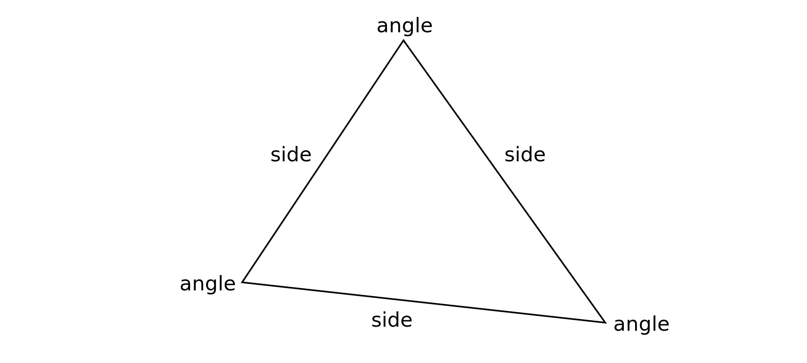
*Figure 1-1. Angles and sides.*

When you go to label these parts, you can do so with single letters. A common convention is to label the three angles with the upper case lettes `A`, `B` and `C`. And the three sides with lower case letters `a`, `b` and `c` as you can see in figure 1-2.

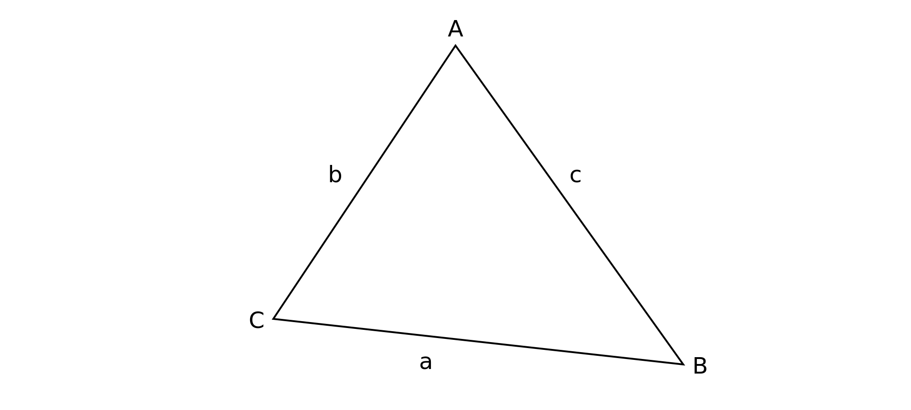
*Figure 1-2. Labeling angles and sides.*

Angles are also sometimes indicated by drawing a small arc inside the angle as seen in figure 1-3.

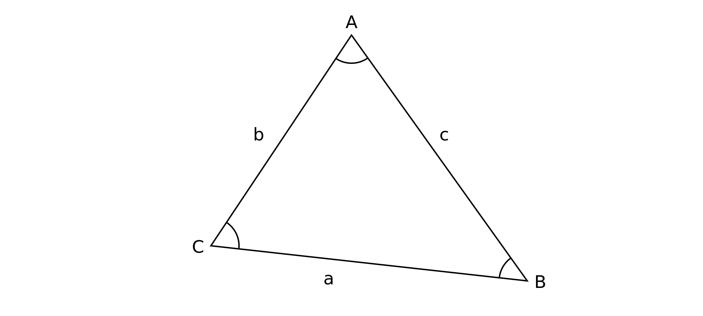
*Figure 1-3. Arcs indicate angles.*

Note that each angle is connected to exactly two sides. In fact, it's the intersection of those two sides that creates that angle. The term for this is the "adjacent" sides. Here, angle `A` is created by the intersection of sides `b` and `c`. So angle `A`'s adjacent sides are `b` and `c`. Or to put it another way, sides `b` and `c` are adjacent to angle `A`. See figure 1-4. If this is new to you, take a few seconds and figure out the adjacent sides for angles `B` and `C`.

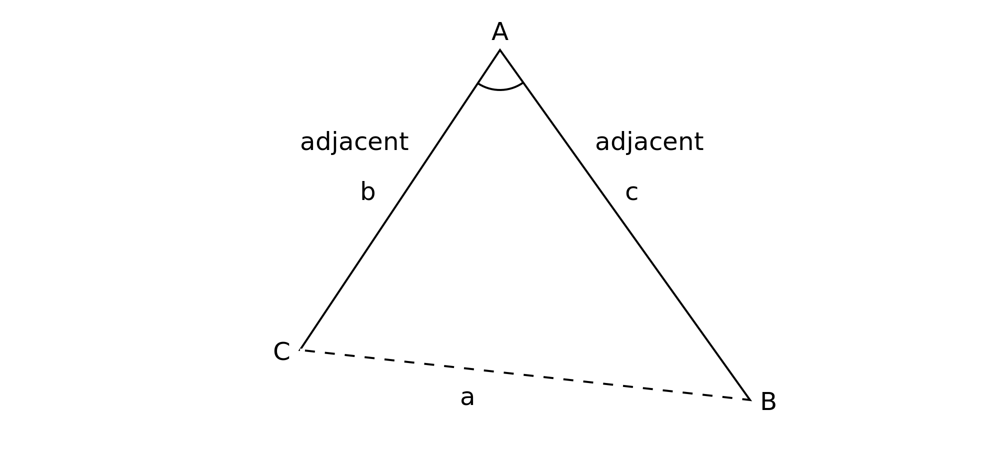
*Figure 1-4. Adjacent sides.*

Also note that side `a` is not connected to angle `A` at all. It's all the way across on the other end of the triangle, directly opposite angle `A`. So we say that side `a` is opposite angle `A`. Or angle `A`'s opposite side is `a`. So any single angle of a triangle has exactly two adjacent sides and one opposite side. Check out figure 1-5.

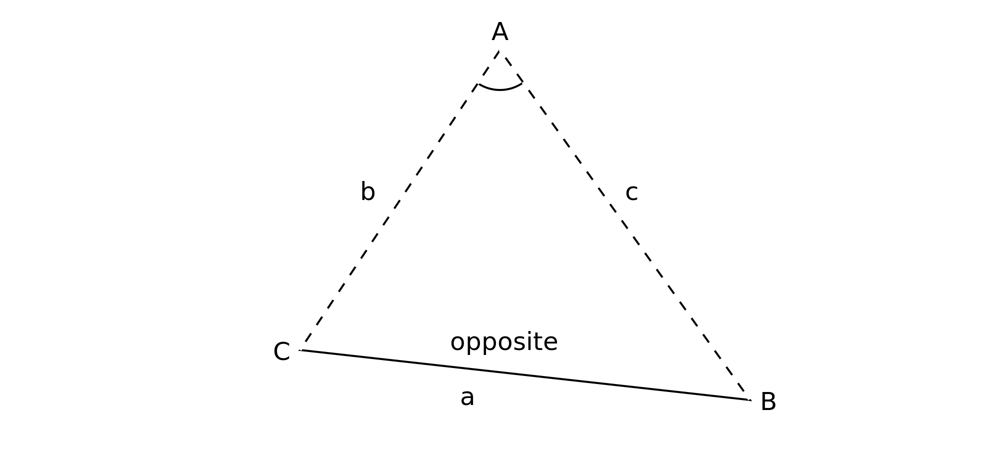
*Figure 1-5. Opposite side.*

I've arranged this so the opposite sides have the same letter as the angle they are opposite to. Side `a` is opposite angle `A`, side `b` is opposite angle `B`, and side `c` is opposite angle `C`. This is not required, but it's an established convention that I'll stick to.

Realize that adjacent and opposite always have to do with the relationships between angles and sides. It wouldn't make sense to say that one side is adjacent to another side, because in a triangle, all sides are adjacent to each other. The same thing goes for angles. And there is no way that any side can be opposite another side or any angle be opposite another angle.

## Measuring Angles

There are a few different systems for measuring angles. The two I'll use in this book are degrees and radians. I'll discuss radians later in the next section. For now, let's consider degrees, as those are generally most familiar from everyday life.

### Degrees

We know that a square or rectangle is composed of ninety degree angles. We know that a 180-degree turn sends you back the same way you came from. We even use this in more abstract ways, saying that someone had a 180-degree change of attitude, for example. And we know that 360 degrees is a full circle. You also hear this in abstract terms such as companies that do "360 reviews", meaning that employees are reviewed by thier peers - the people "all around" them.

But this 360 degree standard is arbitrary. There's nothing magic about it. It most likely comes from a rounding off of the number of days in the year, so that one day is roughly equal to one degree of an orbit of the sun. 360 is also an enormously useful number to divide into. You can evenly divide 360 by 1, 2, 3, 4, 5, 6, 8, 9, 10, 12, 15, 18, 20, 24, 30, 36, 40, 45, 60, 72, 90, 120, 180, and 360. Pretty useful back in the days before calculators.

Generally, when you measure the angles around from 0 to 360, you start pointing due right as zero degrees. As you increase the angle, you go counter-clockwise, through 90, 180, 270 and back to 360 degrees, which is the same as 0. You can see this in figure 1-6.

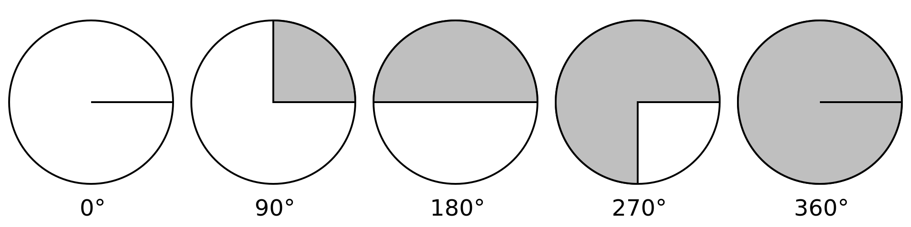
*Figure 1-6. Angles going around counter-clockwise.*

You can also go the other way - clockwise - using negative angles. So -90 degrees is the same as 270 degrees. -180 is the same as 180, and -270 is the same as 90. And of course, -360 degrees is the same as 360 or 0. See figure 1-7.

*Figure 1-7. Negative angles going around clockwise.*

Now while this counter-clockwise rotation is somewhat of a standard, it is based on a system know as the Cartesian coordinate system. You can see the Cartesian system in figure 1-8. In this system (for two dimensions) you have two axes, which are usually referred to as `x` and `y`. The x-axis increases positively as it goes to the right and negatively as it goes to the left. And the y-axis increases positively as it goes up and negatively as it goes down. Where both axes are zero, this is called the origin.

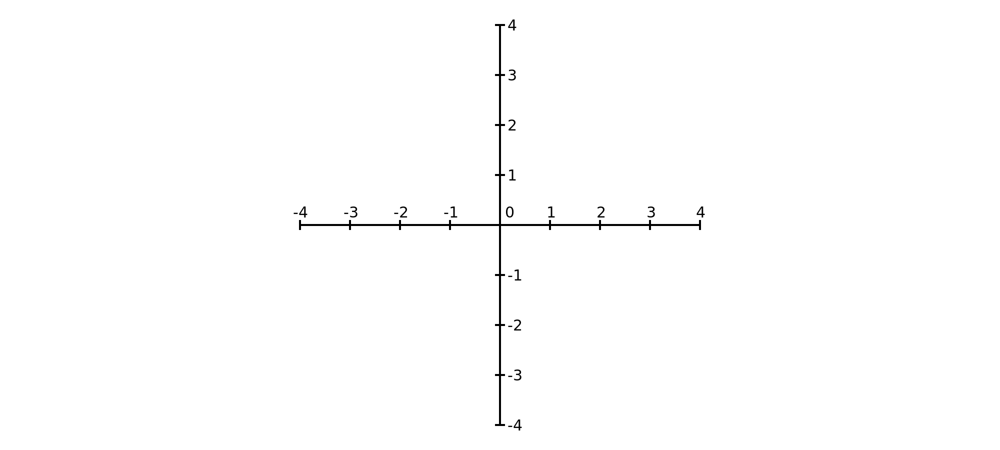
*Figure 1-8. Cartesian coordinates.

However, in many screen-based graphics systems, the y-axis is reversed. The origin usually defaults to the top left corner of the screen. The x-axis is the same, but the y-axis increases as it goes down towards the bottom of the screen. Screen coordinates are demonstrated in figure 1-9.

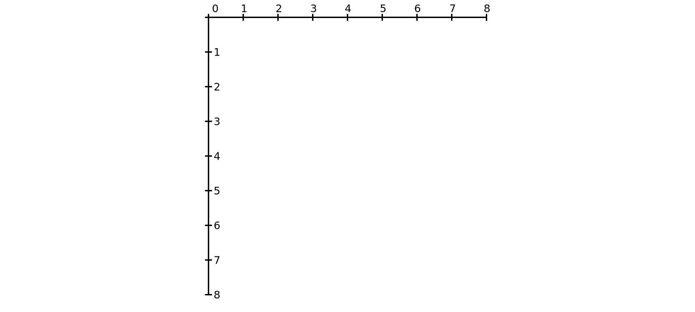
*Figure 1-9. Screen coordinates.

You can usually move the origin to any other location, which gives you access to the negative regions of the x- and y-axes. In figure 1-10, you can clearly see that this is the Cartesian coordinate system flipped upside down.

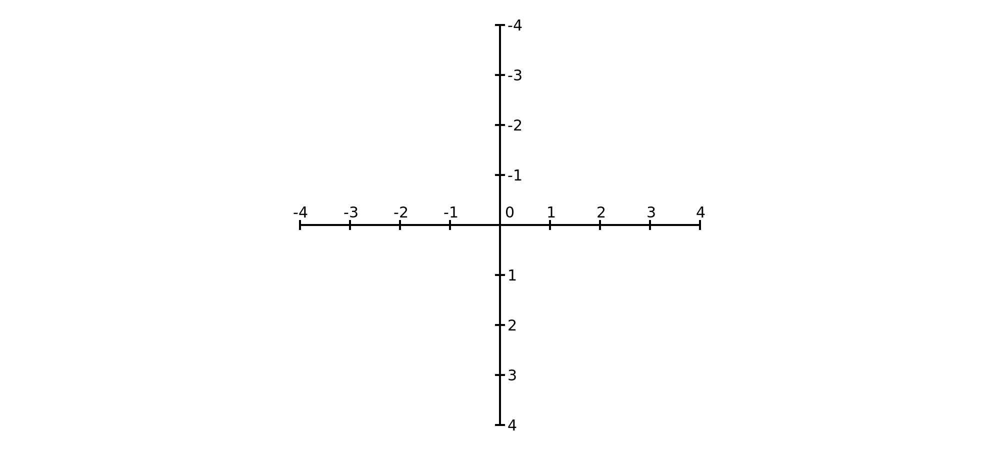
*Figure 1-10. Screen coordinates, translated.

Because of this, the direction of angles is also flipped in these systems, with angles increasing as they go around counter-clockwise. See figure 1-11.

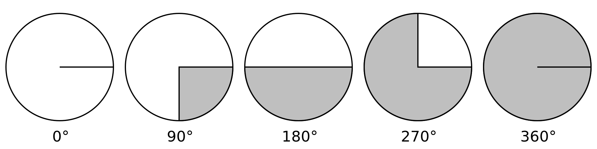
*Figure 1-11. Angles in screen coordinates.*

Later, when I introduce some actual code, I'll show you how you can flip the screen coordinate system to make it act just like a standard Cartesian system.

Note that this not absolutely the way things work for every single graphic programming environment you might work in. Make sure you know how the coordinate system works for the code base you are working in. For this book, I'll assume that the y-axis if flipped, as it is in HTML Canvas.

### Radians

When you start coding anything to do with angles, you'll find that the math libraries for most common programming languages do not use degrees. Instead, they measure angles in units called radians.

To understand radians, let's go back to our circle. The distance from the center of the circle to any point on the perimeter of the circle is the circle's radius. For any angle, you can measure the length of the arc created by that angle. When that arc length is the same as the length of the radius, then we have an angle of one radian. That works out to just about 57.2958 degrees. You can see a radian in figure 1-12. It seems like a strange and rather arbitrary way to divide up a circle, but remember, so is 360.

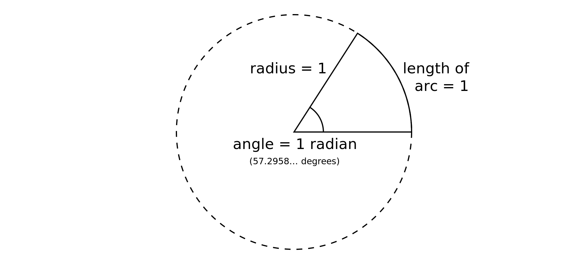
*Figure 1-12. One radian is the angle where the arc length equals the radius.*

And radians have some neat and useful properties as well. Hopefully you are familiar with the concept of PI, represented by the Greek letter π. This is the ratio of the diameter of a circle to its circumference. It works out to about 3.14159. PI is actually an irrational number, meaning that the digits will go on infinitely, but here I'll be rounding everything off to understandable lengths. This means that the distance around a circle is about 3.14159 times the distance across it.

Now say we have a radius of one. That means the diameter is two. And the circumference is two times PI, or very roughly 6.28319. From there, you can work out that the angular measurement of a circle is 2PI radians. You can confirm this visually by marking out each radian, as I did in figure 1-13.

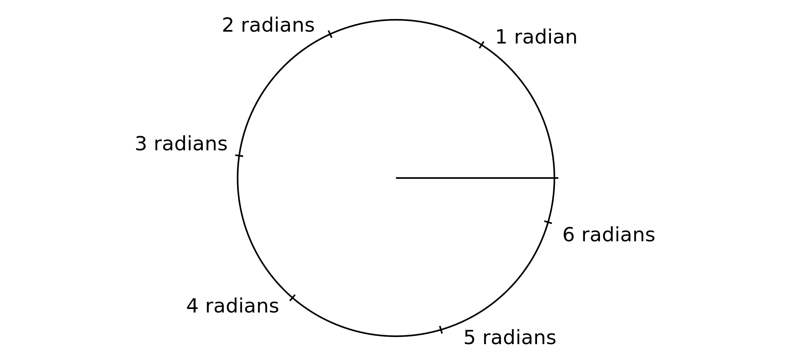 
*Figure 1-13. A circle is 2PI radians.*

Three radians gets us just shy of a half circle, and it's just over six radians for a full circle. In fact it's roughly 6.28319 radians. Or we could work it out mathematically from degrees. 360 degrees divided by 57.2958 degrees (one radian) equals just about 6.28319.

So PI radians is 180 degrees. PI/2 radians is 90 degrees PI/3 = 60. 2PI is 360 and so on. Once you get used to the new system of measurement, it's not so bad.

### Converting between degrees and radians

Often, you'll need to convert between these two systems of angular measurement. So it's useful to create a couple of functions that do this for you. Listing 1-1 is the first bit of code for the book.

    function degreesToRadians(degrees) {
      return degrees / 180 * Math.PI;
    }

    function radiansToDegrees(radians) {
      return radians / Math.PI * 180;
    }

*Listing 1-1*

You can mentally test this with a common angle like 90 degrees, which is PI/2 radians. Putting 90 as an argument to the first function, you get 90/180 or 1/2, times Math.PI equals PI/2.

Or, putting PI/2 into the second function, you get (PI/2)/PI which works out to 1/2. Times 180 equals 90.

## Properties of Triangles

There are a few properties of triangles that are interesting and useful. One is that if you add up the measurements of all three angles, you will always get exactly 180 degrees. (I'm going back to using degrees for this section.)

This property makes it easy to find an unknown angle if you happen to know the other two angles. Say you have a triangle where two angles are 60 degrees and 70 degrees. The total of those is 130 degrees, so you know the third angle must be 50 to equal 180 degrees total.

Another useful thing to know is that the measurement of a given angle is proportional to the length of the opposite side.

In figure 1-14, let's assume that the lengths of sides `b` and `c` will not change. If you make angle `A` smaller, side `a` will be proportionately smaller. And as you increase the angle, the length of side `a` grows proportionately.

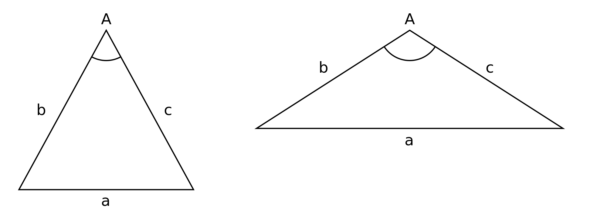 
*Figure 1-14. As angle A increases, the length of side a increases.*

Now if you make angle `A` very close to 180 degrees, as I did in figure 1-15, then the other two angles must become very close to 0 degrees.

 
*Figure 1-15. Angle A is very close to 180 degrees.*

Let's go all the way and make angle `A` exactly 180 degrees. See figure 1-16.

 
*Figure 1-16. Angle A is exactly 180 degrees.*

This means the other two angles must be exactly 0 degrees. This no longer looks like a triangle at all, but mathematically, there's no problem. It still follows all the rules. Also notice that the length of side `a` is now exactly the same as the sum of sides `b` and `c`.

This brings us to a property relating to the sides of triangles. In most cases, the length of any one side will be less than the sum of the other two sides. At best, it will be equal to the sum of the other two sides.

These last two properties are not something you'll use directly very often, but it's often helpful to keep them in mind as you explore other concepts related to trigonometry.

## Special Triangles

I've covered most of what you need to know about triangles in general at this point. But there are a few special types of triangles that you should know about. They have special properties all of their own.

### Equalateral Triangles

The first special triangle is the equalateral triangle. See figure 1-17. In this case, all the angles have the same measurement, and all the sides have the same length. Because the sum of the angles must add up to 180 degrees, each angle must be 180/3 or 60 degrees. And so it is. It does not matter what lengths the sides are, but whatever they are, they are all equal to each other.

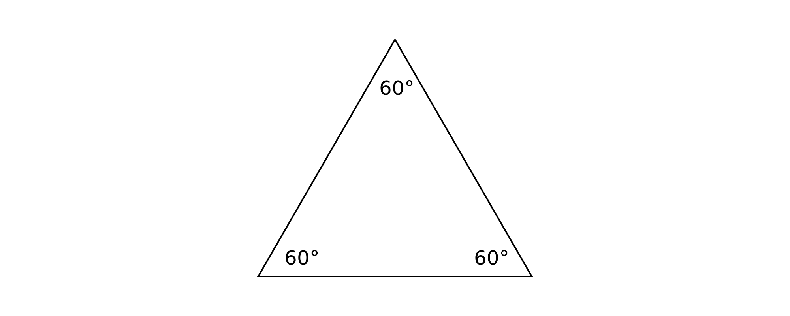 
*Figure 1-17. Equalateral triangle.*

### Isosceles Triangles

The next special triangle is the Isosceles triangle. See figure 1-18. In this case, two of the angles have the same measurement. Hence, two of the sides have the same length.

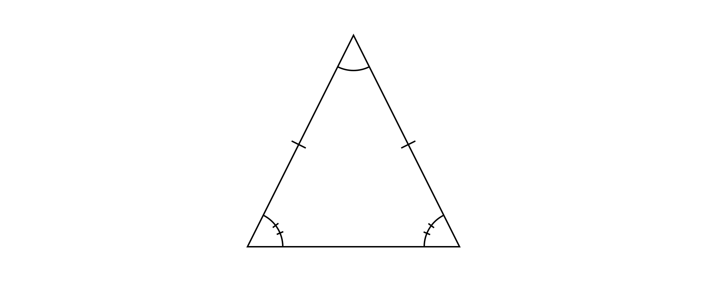 
*Figure 1-18. Isosceles triangle.*

It's common to indicate equality by drawing one or more slashes through sides or the arcs in angles. Here, the single slash through sides `b` and `c` indicate that they are equal. And the double slash through the arcs of the two angles indicate that they have equal measurements. 

### Acute and Obtuse Triangles

Then we come to acute and obtuse triangles, as seen in figure 1-19. In terms of angles, obtuse means greater than 90 degrees, and acute means less than 90 degrees. An obtuse triangle is one in which one of the angles is more than 90 degrees. An acute triangle is where all three angles are less than 90 degrees.

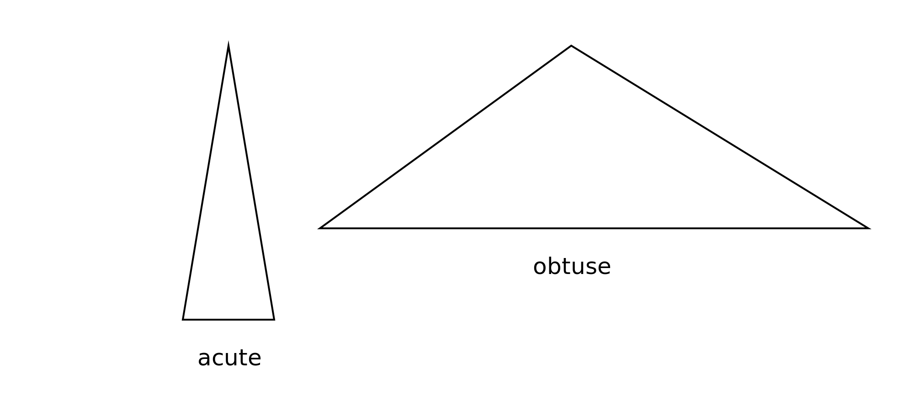
*Figure 1-19. Acute and obtuse triangles.*

You might be wondering why I said just one angle in an obtuse triangle is greater than 90. Remember that the sum of the angles must add up to 180 degrees. If you had, say two angles that measured 91 degrees, the sum would already be 182 without even considering the third angle. So this is impossible. If you still have doubts, try to draw a triangle with two angles greater than 90 degrees.

### Right Triangles

And finally we come down to what will be the most important type of triangle in this book, the right triangle. See figure 1-20. A right triangle is where one of the angles is exactly 90 degrees. A right angle is an angle that measures exactly 90 degrees. We symbolize the right angle by drawing a small square in that corner, rather than the small arc.

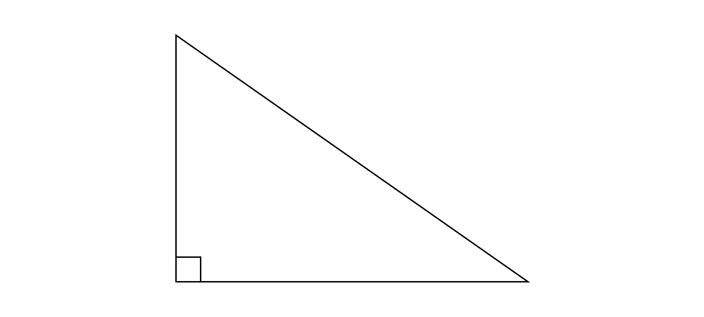 
*Figure 1-20. Right triangle.*

In some more casual situations where it is well established that you are working with right triangles and it is obvious which angle is 90 degrees, you might see the little square omitted. But I'll try to be diligent and include them in this book.

Right triangles have a whole slew of interesting properties. Most of the rest of the book will be involved in exploring some of those different properties. But there are also a couple of new terms that go along with right triangles that I'll get out of the way right here and now.

The two sides that are adjacent to the right angle are known as the legs of the right triangle.

The side opposite the right angle is known as the hypotenuse. These are all shown in figure 1-21.

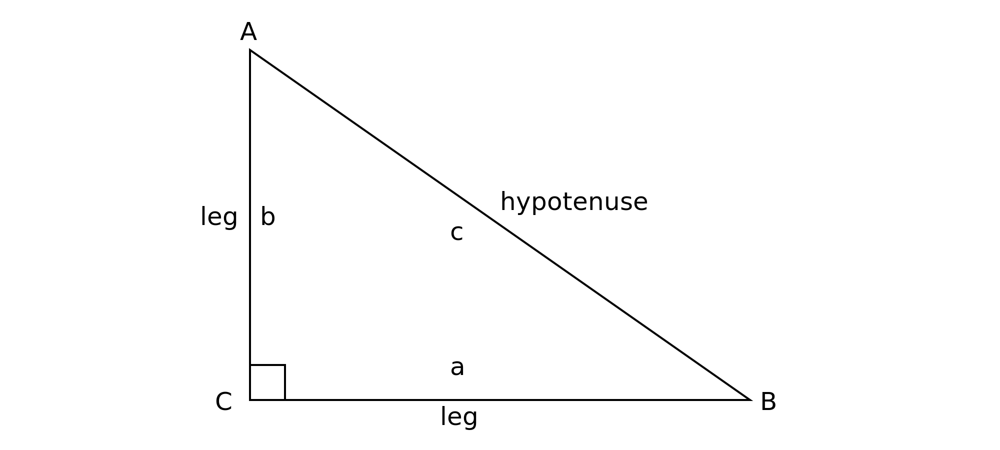 
*Figure 1-21. Sides and hypotenuse.*

There's also a slight change in some existing terminology. In most triangles, you can say that any angle has two adjacent sides. But in a right triangle, you normally don't refer to the hypotenuse as an adjacent side. It's just the hypotenuse.

So, from angle `A`'s perspective, it has an opposite side (side `a`), and adjacent side (side `b`), and the hypotenuse. 

From angle `B`'s perspective, its opposite side is side `b`, its adjacent side is side `a` and the hypotenuse is the same old hypotenuse.

And from the right angle, you just refer to the adjacent sides as the legs and the opposite side as the hypotenuse.

## Summary

This chapter has mostly been about terminology and relationships. Although there's no code in this chapter, most of what is here is very important and will form the foundation of everything in the book. So if there is something you're not fully clear on, make sure you spend the time now to work it out so it doesn't bite you later on.

\newpage
