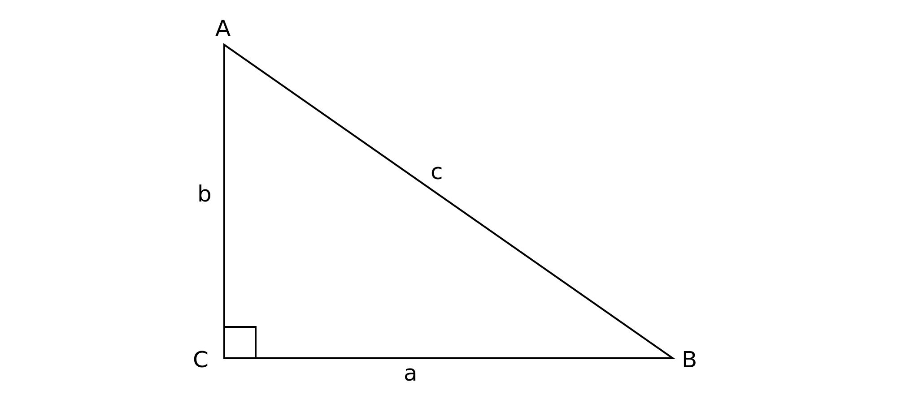
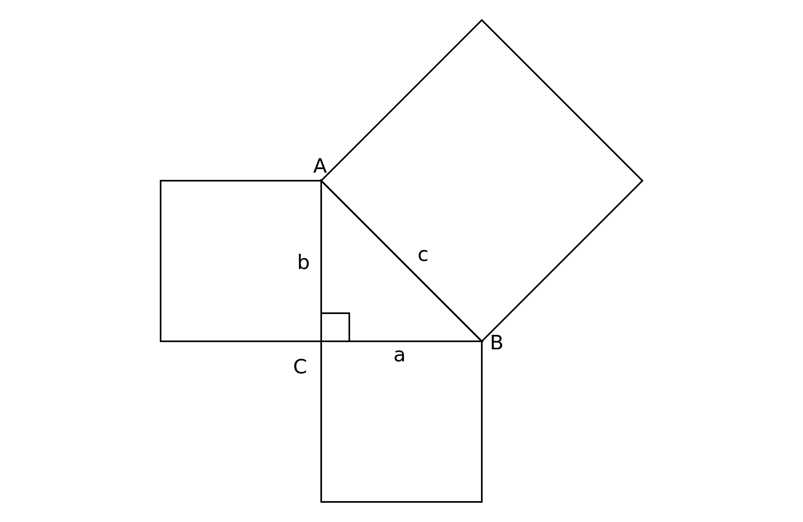
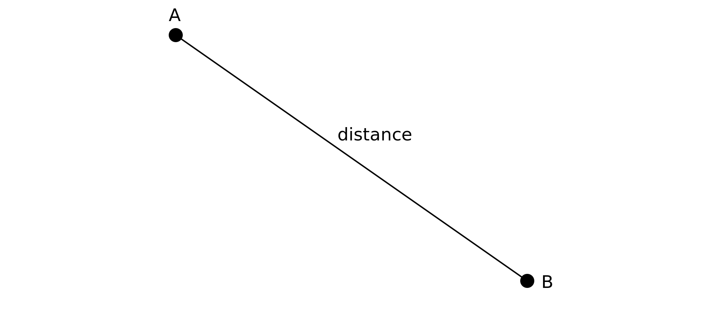
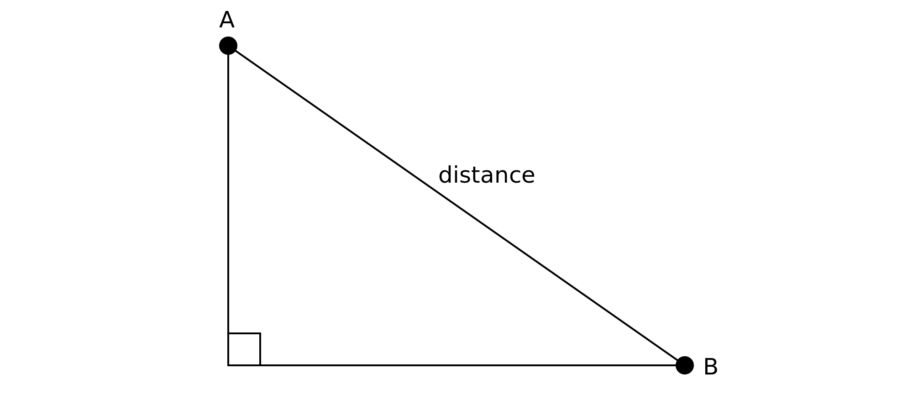
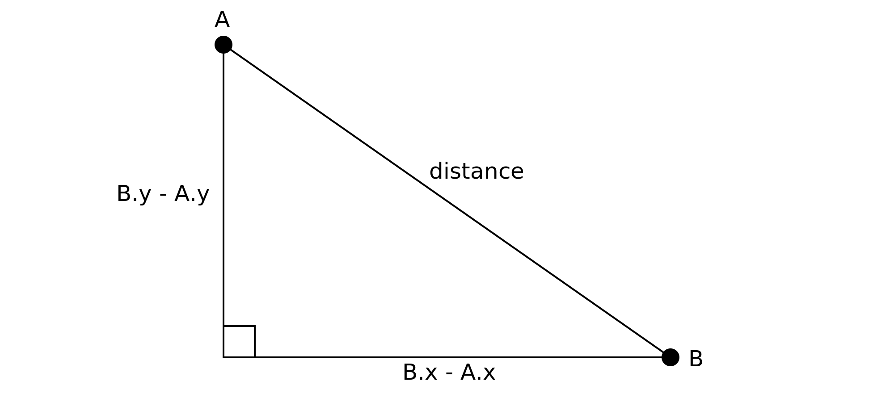
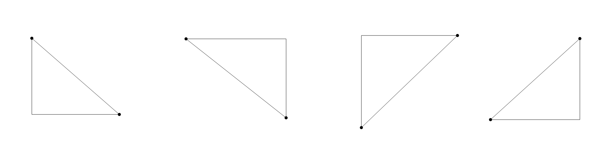
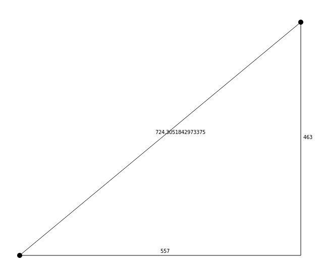
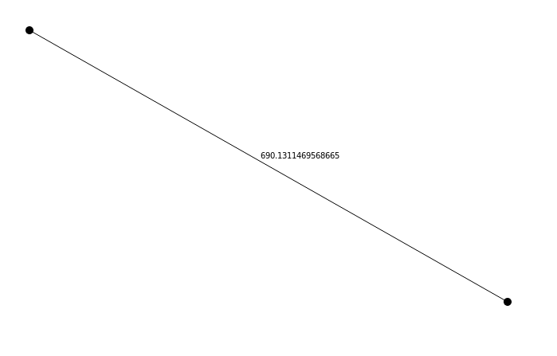
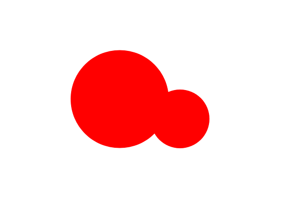

# Chapter 2 - The Pythagorean Theorem

In Chapter 1 you learned the different parts of a triangle and some of the basic relationships between those parts. But there are many more interesting and profound relationships there. Trigonometry is the study of those relationships. A large portion of trig is based on right triangles specifically. So for the rest of the book, unless I explicitly state otherwise, you can assume that I'm talking about right triangles.

In this chapter, we'll cover a relationship known as the Pythagorean Theorem. This has solely to do with the lengths of the sides of a right triangle. Beyond the fact that you know one of the angles is 90 degrees, angles are irrelevant for this theorem.

The Pythagorean Theorem states that the sum of the squares of the two legs of a right triangle is equal to the square of the hypotenuse. That's mouthful, so you often hear it in its much-abbreviated form, "a squared plus b squared = c squared" or "a^2 + b^2 = c^2". And this is true as long as you name the legs `a` and `b` and the hypotenuse `c`. See figure 3-1.

*Figure 3-1. Side a squared, plus side b squared equals side c squared.*

So, if you measure side `a`, square it, measure side `b` and square it, then add those two results together, you'll get the square of the length of side `c`. You'll very often seen this represented with actual squares hanging off each side of the triangle, much like figure 3-2.

*Figure 3-2. The combined area of the two smaller squares equals the area of the larger one.*

Now, the area of square A plus the area of square B is equal to the area of square C. There are numerous proofs of this theorem. Some are quite ingenious and visually pleasing. If you search Youtube, you'll probably come up with a few really nice ones. For the purposes of this book, I'm not going to go into trying to prove the theorem though. I'll dive straight into how to use it.

One of the core uses of the Pythagorean Theorem is measuring the distance between any two arbitrary points on a two-dimensional plane. See figure 3-3.

*Figure 3-3. The line represents the distance between the two points.*

It might not be immediately obvious how the theorem would help in this case. There's no triangle here, much less a right triangle. There are only two points, which can only create a line, not a triangle. Let me show you the trickery. First, in figure 3-4, I'll extend a line down along the y-axis from point A, and a line across on the x-axis from point B.

*Figure 3-4. Extend lines from each point.*

Magically, a triangle appears! Not just any triangle, either. It's a right triangle! And if you calculate the distance between the two points on the x-axis, by subtracting one from the other, you get the length of that side. Do the same on the y-axis and you have the length of that side. Square each one, add the results and take the square root of that, and you have the distance between the two points. See figure 3-5.

*Figure 3-5. Calculate the length of the two legs by subtracting.*

By now, I bet you're ready to write some code. Let's do it. Start with the basic project template described in the introduction. This sets up a canvas that fills the browser window, and gets its 2d drawing context.

The idea is that when the user clicks on the canvas, the code creates a 2d point there. When the canvas is clicked again, it creates another point, draws a line between them, and calculates the distance between them. On a third click, the points are cleared.

To start with, let's make an array to hold the points, and set up the click handler. You can see this in listing 3-1.

    const canvas = document.getElementById("canvas");
    const context = canvas.getContext("2d");
    const width = canvas.width = window.innerWidth;
    const height = canvas.height = window.innerHeight;

    const points = [];

    canvas.addEventListener("click", onClick);

*Listing 3-1*

Next, let's create the `onClick` handler. See listing 3-2. If there are less than two points in the array, it will add a new point based on the clicked position. If there are already two points, it will clear the array by setting its length to zero. Finally, it will call a `render` function, which I'll show you right after this.

    function onClick(event) {
      if (points.length < 2) {
        points.push({ x: event.clientX, y: event.clientY });
      } else {
        points.length = 0;
      }
      render();
    }

*Listing 3-2*

For now, the points will just be plain JavaScript objects with an `x` and `y` property. We can get those from the `event`'s `clientX` and `clientY` properties. This works well because the canvas is set to fill the browser window and all margins and paddings have been removed. If the canvas was not directly aligned with the browser window, you'd have to convert between the `clientX` and `clientY` positions and the canvas clicked position. If you find yourself needing to do that, the `getClientBoundingRect` function will help you there. In this book, though, all the canvases will be aligned, so you won't have to worry about it.

Now that `render` function. To start with, this will clear the canvas and draw any points that are in the `points` array. See listing 3-3.

    function render() {
      context.clearRect(0, 0, width, height);
      for(let i = 0; i < points.length; i++) {
        const p = points[i];
        context.beginPath();
        context.arc(p.x, p.y, 5, 0, Math.PI * 2);
        context.fill();
      }
    }

*Listing 3-3*

In the canvas drawing API, circles are drawn by calling `beginPath`, then drawing an arc, then calling `fill` or `stroke`. The `arc` method takes the `x`, `y` position of the center of the circle, the radius of the circle, and the start and end angles to draw the arc, in radians. To draw a full circle, go from 0 radians to PI * 2 radians (360 degrees).

You can test this now by loading index.html in any modern browser. Click once on the canvas and a point will be drawn where you clicked. Click again, another point. Click a third time, and they both go away. Keep clicking to create more pairs of points.

If there are zero or one points, that's all that needs to be done. But if there are two points on the screen, you want to calculate the distance between them. So the rest of this function will go in a conditional that checks first to see if there are two points in the `points` array. If so, let's visually draw that right triangle with the code in listing 3-4.

    function render() {
      context.clearRect(0, 0, width, height);
      for(let i = 0; i < points.length; i++) {
        const p = points[i];
        context.beginPath();
        context.arc(p.x, p.y, 5, 0, Math.PI * 2);
        context.fill();
      }
      if (points.length === 2) {
        context.beginPath();
        context.moveTo(points[0].x, points[0].y);
        context.lineTo(points[1].x, points[1].y);
        context.lineTo(points[1].x, points[0].y);
        context.lineTo(points[0].x, points[0].y);
        context.stroke();
      }
    }

*Listing 3-4*

Again, begin a path. Then move to the first point, draw a line to the second point. The next line is tricky. It draws a line to the `x` of point 1 and the `y` of point 0. If you refer back to the earlier figures in this chapter, you'll see that this is the intersection of the two lines that make up the right angle of the triangle. Finally, one last line back to the first point, and stroke that path.

Now when you run this and click around, you'll get one point, then two points with a right triangle drawn to fit those two points. Click again to clear. You'll notice that depending on where you click, you might get the triangle being drawn so that its right angle is in an upper corner or a lower corner. You can see some examples in figure 3-6.

*Figure 3-6. Drawing some triangles with code.*

This is no problem. It all depends on that intersecting point. You could change it so it is created with the `x` of point 0 and the `y` of point 1, which would reverse the way it is drawn. Or you could do some conditional logic to find out which point was lower on the y-axis and use its `y` and the other 

point's `x`. This would force it to always orient the right angle in one of the lower corners. I'm not going to worry about it for the sake of this example though.

Now, in listing 3-5, let's calculate the lengths of the sides of this triangle.

    const a = Math.abs(points[0].x - points[1].x);
    const b = Math.abs(points[0].y - points[1].y);
    const c = Math.sqrt(a * a + b * b);

*Listing 3-5*

For sides `a` and `b`, subtract the points' `x` and `y` values. It doesn't really matter which one you subtract from which here. But depending on their positions, you have a good chance of winding up with a negative number. For the distance calculation, that is not a problem, as you'll be squaring both of them, which will make them positive in either case. But in this case, you'll be displaying the distances on the canvas, so it's nice to use `Math.abs` to coerce it into a positive value. The distance itself is calculated all in one line, squaring `a`, squaring `b` and taking the square root.

Finally, let's display the values right on the canvas, as seen in listing 3-6.

    context.fillText(a, (points[0].x + points[1].x) / 2, points[0].y - 5);
    context.fillText(b, points[1].x + 5, (points[0].y + points[1].y) / 2);
    context.fillText( c, (points[0].x + points[1].x) / 2 - 10,
                         (points[0].y + points[1].y) / 2 - 10);

*Listing 3-6*

This uses the `fillText` method to draw the value of `a`, `b`, and `c` to the canvas, calculating the position to be roughly at the center point of each line, with a bit of an offset so it's not sitting right on the line. The result is in figure 3-7.

*Figure 3-7. Labeling the distances.*

Listing 3-7 shows the full final code for this example:

    const canvas = document.getElementById("canvas");
    const context = canvas.getContext("2d");
    const width = canvas.width = window.innerWidth;
    const height = canvas.height = window.innerHeight;

    const points = [];

    canvas.addEventListener("click", onClick);

    function onClick(event) {
      if (points.length < 2) {
        points.push({ x: event.clientX, y: event.clientY });
      } else {
        points.length = 0;
      }
      render();
    }

    function render() {
      context.clearRect(0, 0, width, height);
      for(let i = 0; i < points.length; i++) {
        const p = points[i];
        context.beginPath();
        context.arc(p.x, p.y, 5, 0, Math.PI * 2);
        context.fill();
      }
      if (points.length === 2) {
        context.beginPath();
        context.moveTo(points[0].x, points[0].y);
        context.lineTo(points[1].x, points[1].y);
        context.lineTo(points[1].x, points[0].y);
        context.lineTo(points[0].x, points[0].y);
        context.stroke();

        const a = Math.abs(points[0].x - points[1].x);
        const b = Math.abs(points[0].y - points[1].y);
        const c = Math.sqrt(a * a + b * b);

        context.fillText(a, (points[0].x + points[1].x) / 2, points[0].y - 5);
        context.fillText(b, points[1].x + 5, (points[0].y + points[1].y) / 2);
        context.fillText(c, (points[0].x + points[1].x) / 2 - 10,
                            (points[0].y + points[1].y) / 2 - 10);

      }
    }

*Listing 3-7*

## Making a Point Class

At this time, let's start thinking about writing some reusable code. I'll start with a class called `Point` in a file called `point.js`. See listing 3-8. If you already have some other library that contains a Point class, that should work fine. But you might want to follow along anyway and create this simple class to fully understand how it works.

    class Point {
      constructor(x, y) {
        this.x = x;
        this.y = y;
      }

      distance(p) {
        const dx = this.x - p.x;
        const dy = this.y - p.y;
        return Math.sqrt(dx * dx + dy * dy);
      }
    }

*Listing 3-8*

This is quite a simple class for now. Its constructor takes an `x` and a `y` values and saves those. It has a `distance` method that does what I just described in the earlier example. Its argument is another `Point` instance. Since this is only calculating the final distance, it doesn't need to use `Math.abs` to convert the side lengths to positive numbers.

You'll need to load this `Point` class in the HTML file, something like in listing 3-9.

    <!DOCTYPE html>
    <html>
      <head>
        
      </head>
      <body>
        <canvas id="canvas"></canvas>
        
        
      </body>
    </html>

*Listing 3-9*

Of course, feel free to turn this into a nodejs module or an ES6 module, or whatever else works for you. I'm going to keep things as simple as possible here.

Now, the `main.js` file can be simplified a bit. See listing 3-10.

    const canvas = document.getElementById("canvas");
    const context = canvas.getContext("2d");
    const width = canvas.width = window.innerWidth;
    const height = canvas.height = window.innerHeight;

    const points = [];

    canvas.addEventListener("click", onClick);

    function onClick(event) {
      if (points.length < 2) {
        points.push(new Point(event.clientX, event.clientY));
      } else {
        points.length = 0;
      }
      render();
    }

    function render() {
      context.clearRect(0, 0, width, height);
      for(let i = 0; i < points.length; i++) {
        const p = points[i];
        context.beginPath();
        context.arc(p.x, p.y, 5, 0, Math.PI * 2);
        context.fill();
      }
      if (points.length === 2) {
        context.beginPath();
        context.moveTo(points[0].x, points[0].y);
        context.lineTo(points[1].x, points[1].y);
        context.stroke();

        const dist = points[0].distance(points[1]);

        context.fillText(dist, (points[0].x + points[1].x) / 2 - 10,
                               (points[0].y + points[1].y) / 2 - 10);
      }
    }

*Listing 3-10*

Instead of creating a new generic point object, this creates an instance of the `Point` class and pushes it on the array. Listing 3-11 shows this in isolation.

    points.push(new Point(event.clientX, event.clientY));

*Listing 3-11*

Then, when it goes to calculate the distance, it can just get one point and call its `distance` method, passing in the other point, as seen in isolation in listing 3-12.

    const dist = points[0].distance(points[1]);

*Listing 3-12*

I left off drawing the other lines and labeling their lengths, focusing just on the distance. You can see the result in figure 3.8.

*Figure 3-8. The distance between two points.*

## Circle Collisions

What else can you do with the Pythagorean theorem? Oddly enough, although the theorem deals with triangles, it is very useful for detecting whether a point is within a circle, or whether a circle intersects another circle.

For this next example, I'll start off with exactly the same HTML file, including the new `Point` class. And I'll keep the same initial JavaScript for getting the canvas reference. Then I'll create two points and a value for a radius, and make a call to a function called `render`. This is listing 3-13.

    const canvas = document.getElementById("canvas");
    const context = canvas.getContext("2d");
    const width = canvas.width = window.innerWidth;
    const height = canvas.height = window.innerHeight;

    const p0 = new Point(width / 2, height / 2);
    const p1 = new Point(0, 0);
    const radius = 100;
    render();

*Listing 3-13*

You'll see that the first point, `p0` is set to the center of the canvas. The second one, `p1` is initially set to 0, 0. 

For now, the `render` function just draws a circle at the location of `p0` using the value of `radius`. See listing 3-14.

    function render() {
      context.clearRect(0, 0, width, height);
      context.beginPath();
      context.arc(p0.x, p0.y, radius, 0, Math.PI * 2);
      context.fill();
    }

*Listing 3-14*

The goal is to change the color of the circle when the mouse cursor is within the circle, and change it back when it leaves. So if you set the position of `p1` to be equal to the current mouse position, you can then use the `Point.distance` method to calculate how far apart the two points are. If that distance is less than `radius` than the mouse cursor is within the circle. Listing 3-15 shows the code in full.

    const canvas = document.getElementById("canvas");
    const context = canvas.getContext("2d");
    const width = canvas.width = window.innerWidth;
    const height = canvas.height = window.innerHeight;

    const p0 = new Point(width / 2, height / 2);
    const p1 = new Point(0, 0);
    const radius = 100;
    render();

    canvas.addEventListener("mousemove", onMouseMove);

    function onMouseMove(event) {
      p1.x = event.clientX;
      p1.y = event.clientY;
      render();
    }

    function render() {
      context.clearRect(0, 0, width, height);
      const dist = p1.distance(p0);
      if(dist < radius) {
        context.fillStyle = "red";
      } else {
        context.fillStyle = "black";
      }

      context.beginPath();
      context.arc(p0.x, p0.y, radius, 0, Math.PI * 2);
      context.fill();
    }

*Listing 3-15*

The `render` method calculates `dist` using `p1.distance(p0)`. If `dist` is less than `render`, set the fill style to red. Otherwise, set it to black. The effect is that when you mouse over the circle, it changes to red. Mouse out, back to black.

You can do other things here, too. Listing 3-16 demonstrates using CSS to change the cursor style to indicate that the circle is possibly interactive in some way.

    if(dist < radius) {
      context.fillStyle = "red";
      canvas.style.cursor = "pointer";
    } else {
      context.fillStyle = "black";
      canvas.style.cursor = "default";
    }

*Listing 3-16*

You can expand on this to do circle-to-circle collision. A circle is defined by a center point and a radius. If you have two circles, A and B, you can easily find the distance between their two center points. If that distance is less than the sum of the two circles' radii, they are overlapping. If that distance is greater, they are not.

The code for this doesn't change a whole lot. It's all in listing 3-17.

    const canvas = document.getElementById("canvas");
    const context = canvas.getContext("2d");
    const width = canvas.width = window.innerWidth;
    const height = canvas.height = window.innerHeight;

    const p0 = new Point(width / 2, height / 2);
    const p1 = new Point(0, 0);
    const r0 = 100;
    const r1 = 60;

    render();

    canvas.addEventListener("mousemove", onMouseMove);

    function onMouseMove(event) {
      p1.x = event.clientX;
      p1.y = event.clientY;
      render();
    }

    function render() {
      context.clearRect(0, 0, width, height);
      const dist = p1.distance(p0);
      if(dist < r0 + r1) {
        context.fillStyle = "red";
      } else {
        context.fillStyle = "black";
      }

      context.beginPath();
      context.arc(p0.x, p0.y, r0, 0, Math.PI * 2);
      context.fill();

      context.beginPath();
      context.arc(p1.x, p1.y, r1, 0, Math.PI * 2);
      context.fill();
    }

*Listing 3-17*

Instead of just `radius`, I've defined `r0` and `r` for the two circles. Then in the `render` method, instead of checking if `dist < radius` I check `dist < r0 + r`. Finally, I draw both circles, using `r0` for `p0` and `r` for `p1`.

Now as you move the mouse around, a 60-pixel radius circle is drawn around the cursor. When that circle touches the center circle, they both turn red. Try changing the two radius values. Things should continue to work perfectly. In fact, if you set `r` to zero, you'll wind up with the same setup you had in the earlier example. Figure 3.9 shows the result of this example.

*Figure 3-9. Circle-circle collision detection.*

Everything in this section comes under the heading of "collision detection". This is useful in user interfaces to tell when a user has clicked on a certain area of the screen. It's also useful in games. If a game object is a circle, or can be approximated by a circle, you can use these techniques to detect game collisions. Examples would be a bullet hitting a spaceship (circle-point collision) or two spaceships hitting each other (circle-circle collision). Obviously, there are many other types of collision detection for other shapes, but this is the one that most applies to the subject matter of this book.

## Three dimensions

It's also worth noting that the Pythagorean theorem also works in three dimensions (and beyond). If you have two three-dimensional points, where each one has `x`, `y` and `z` positions in 3d space, you find the distance between the two the same way you do in 2d. Get the distance on each axis, square it, add them together and take the square root. The code might look something like in listing 3-18.

    function distance3d(p0, p1) {
      const dx = p0.x - p1.x;
      const dy = p0.y - p1.y;
      const dz = p0.z - p1.z;
      return Math.sqrt(dx * dx + dy * dy + dz * dz);
    }

*Listing 3-18*

This book will stick to two dimensions only, but if you venture into the realms of 3d, you'll at least have that much to start with.

## Summary

In this chapter you learned about the Pythagorean theorem and how that can be used to find the distance between two points. Although there are other uses for the theorem, this is by far the one you'll use it for most often.

Experiment with all of the examples in this chapter and see what else you can do with them.

\newpage
