# Chapter 4 - Sine and Cosine

Chapter 3 covered the Pythagorean theorem, which is a special relationship between the three sides of a right triangle. Other than the fact of that one 90 degree angle, it's all about side lengths. As long as you have that right angle, the relationship of the sides holds true, no matter what the other angles are.

But now let's go into some more complex relationships. These are the relationships between a single angle of a right triangle and the ratio of two sides of its sides.

Remember back in chapter 1, I showed that when one angle of a triangle increases or decreases (and the adjacent sides remain the same length), the opposite side increases or decreases in proportion. With right triangles, there is a similar relationship, but a bit more complex and much more useful.

Of course, you can't have both adjacent sides keep their lengths, because that would break the right angle. But you can say that one of the sides, usually the hypotenuse, will stay the same.

Figure 4.1 shows what happens when this occurs in a right triangle.

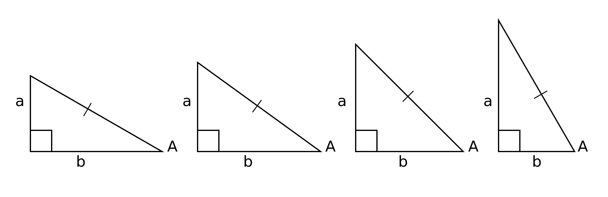
*Figure 4-1. Changing an angle in a right triangle.*

You can see that as angle A changes, and side c (the hypotenuse) stays the same length, side a (the opposite side) gets larger, and side b (the adjacent side) gets smaller.

Now you can consider three ratios in relationship to this angle. 

1. The ratio of the opposite side to the hypotenuse.
2. The ratio of the adjacent side to the hypotenuse.
3. The ratio of the opposite side to the adjacent side.

The important thing to realize is that it doesn't matter what the measurements of the sides are. For any given angle, those ratios will *always* be the same.

These three ratios are the most important thing you need to learn and memorize about trigonomotry. They are at the core of everything else you'll see in this book. They are so important, they have special names: sine, cosine and tangent.

- sine = opposite / hypotenuse (SOH)
- cosine = adjacent / hypotenuse (CAH)
- tangent = opposite / adjacent (TOA)

If you took trigonometry in school, you were probably taught "SOH, CAH, TOA" as a way to remember these three ratios, along with the visual of some guy soaking his swollen toe in a bathtub. As mnemonics go, it's one of the one's that's stuck around pretty well.

Keep in mind that it doesn't matter what size the triangle is. For any given angle, those ratios will be exactly the same.

Take figure 4-2 for example. Angle A in the first triangle is 30 degrees. Its opposite side has a length of 3 and the hypotenuse measures 6. Thus, the sine of 30 degrees is 3 / 6, or 0.5. The second triangle is twice as big, but angle A is still 30 degrees. The opposite side is 6 and the hypotenuse is 12. So the sine of angle A is now 6 / 12, which is still 0.5.

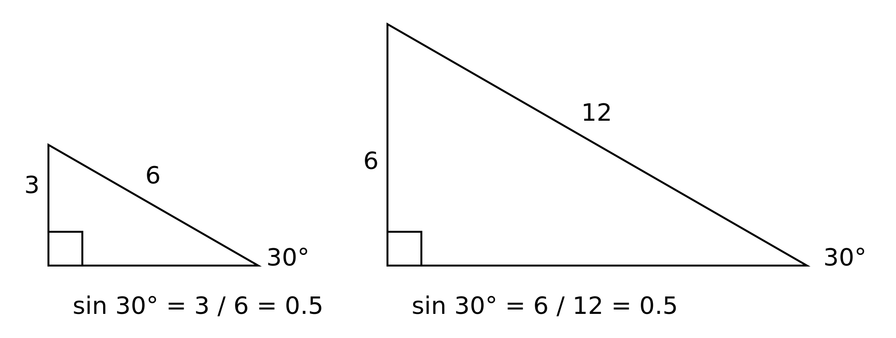
*Figure 4-2. Same angle, same ratio.*

So these values hold true for any angle. When I was a kid, our math textbooks had pages and pages of charts in the back. For each angle, in maybe 1/10th of a degree intervals, it would give you the sine, cosine, tangent, and maybe some other values for that angle. The table shown in figure 4-3 gives values in degrees and minutes, where a minute is 1/60 of a degree. Of course, now even cheap calculators have these functions built in, and provide a much higher degree of accuracy. Try using a physical calculator, or even one built into your phone or browser to verify that the sine of 30 degrees is 0.5 

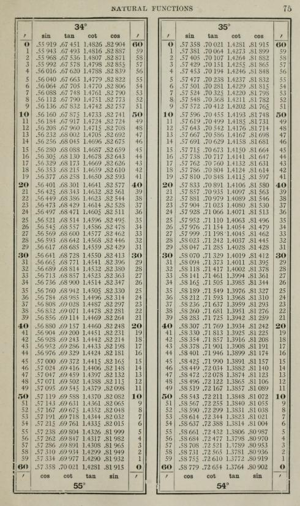 
*Figure 4-3. A trigonometry table from an old textbook. (ref: https://archive.org/details/planetrigonometr00robb/page/74)*

Sticking with sine for a bit, let's see what happens to the values of sine when an angle increases. And let's continue to use degrees and Cartesian coordinates for the time being.

We'll arrange the triangle so that angle A is at the origin (0, 0) and the angle will increase as it goes counter-clockwise. In figure 4-4, angle A is very small, close to zero. So the length of the opposite side is also close to zero. Thus the ratio of the opposite side and the hypotenuse will also be close to zero.

*Figure 4-4. An angle close to zero.*

If you can imagine angle A at exactly zero degrees, then the opposite side would have a length of zero and the ratio of opposite to hypotenuse would be zero. And so it is that the sine of zero degrees is zero. As angle A increases, the length of the opposite side increases. In figure 4-5, angle A is very close to 90 degrees.

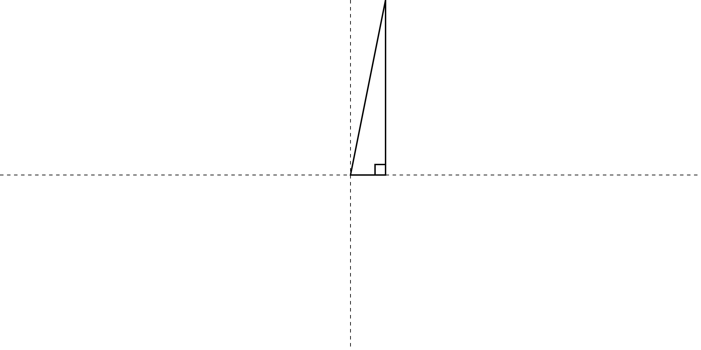
*Figure 4-5. An angle close to 90 degrees.*

And you can see that the length of the opposite side is very nearly the same as the length of the hypotenuse. So the sine of angle A is approaching one. When angle A reaches exactly one, the opposite side and hypotenuse will be the same length. Thus, the sine of 90 degrees is exactly one.

Now an interesting thing happens when we go past 90 degrees. As you can see in figure 4-6, in order to maintain a right triangle, we have to flip the triangle over into the upper left quadrant. And you can see that as the angle increases from 90 to 180 degrees, the opposite side gets smaller and smaller, until it gets back to zero at 180 degrees.

*Figure 4-6. An angle between 90 and 180 degrees.*

But the real magic happens between 180 and 360 degrees, as you can see in figure 4-7. Here, the triangle flips to the lower left and right quadrants. Because we are in the negative portion of the y-axis, we should consider the length of the opposite side to be a negative number. So we see the sine of angle A go from 0, down to negative one at 270 degrees, and then back up until it hits zero again at 360 degrees.

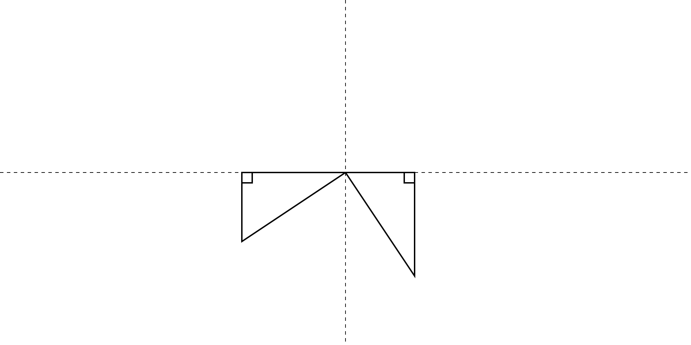
*Figure 4-7. Angles between 180 and 360 degrees.*

Let's write some code to see this in action!

For the first go, we'll just log out the results of the calculations. And at this point, you might as well start getting use to working in radians. The plan is simple. We'll create a `for` loop that goes from 0 to 2 π in some increment, and just log the sine of that value. The code is in listing 4-1.

    for (let i = 0; i <= Math.PI * 2; i += 0.2) {
      console.log(Math.sin(i));
    }

*Listing 4-1*

And figure 4-8 shows the output of that.

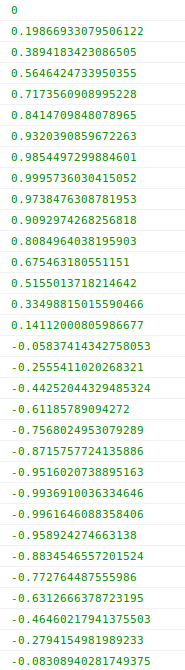 
*Figure 4-8. Sine values for 0 to 2 π.*

You can see that we start at 0.0, go up very close to 1.0, back down past 0.0 into the negative realm, past -1.0 and back to almost 0.0. You might be wondering why you are not seeing exactly 1.0, -1.0 and 0.0 logged out there. That's because we're increasing the loop value by 0.2 on each iteration. We'll never hit exactly π / 2 radians (90 degrees). We'll get close to it and then the next iteration will jump right past it. Likewise for the other values.

Now how about graphing this out? We know we have an input value that ranges from 0 to 2π (around 6.28) and an output value that ranges from -1 to +1. Let's multiply the input value by 100, which will give us values from 0 to around 628. And the same for the output values which will give us -100 to +100. We can then plot the values on the screen and see what that gives us. Check listing 4-2 for the code.
    
    const canvas = document.getElementById("canvas");
    const context = canvas.getContext("2d");
    const width = canvas.width = window.innerWidth;
    const height = canvas.height = window.innerHeight;

    context.translate(0, height / 2);

    context.beginPath();
    for (let i = 0; i <= Math.PI * 2; i += 0.2) {
      let x = i * 100;
      let y = Math.sin(i) * 100;
      context.lineTo(x, y);
    }
    context.stroke();

*Listing 4-2*

Of course we'll need the HTML file as described in the introduction. And this listing has the lines that get a reference to the canvas its context and set its size. Then we need to translate the canvas down by `height / 2`. That puts the 0 position of the y-axis in the center of the screen. Then we just get the `x` and `y` by multiplying the input and output by 100 and executing a `lineTo` to that point and finally stroking that path. You can see the output in figure 4-9.

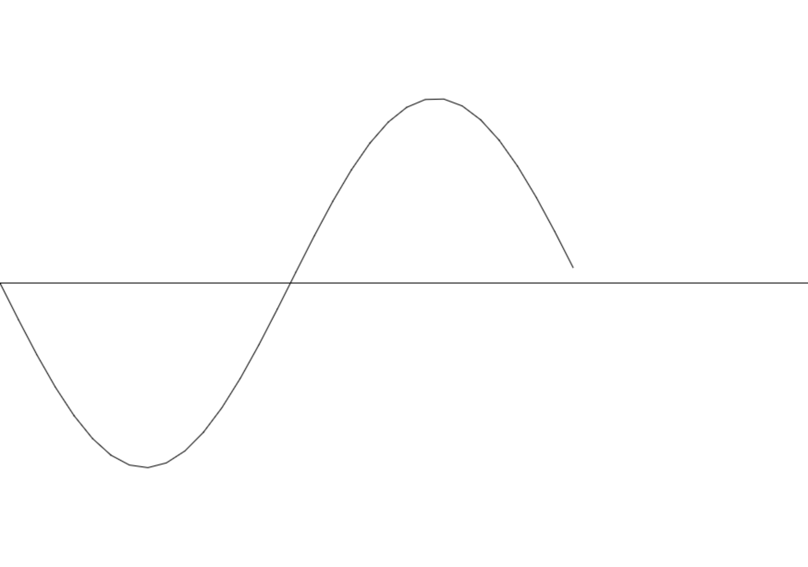 
*Figure 4-9. Our first sine wave.*

But that looks upside down. Normally a sine wave starts at zero and goes UP to one and then back down through zero to negative one and back up to zero. Just remember that our y-axis screen coordinates are reversed from the Cartisian coordinates. If that matters, you can flip the coordinate system by using `scale` right after the `translate` as in listing 4-3.

    ...
    context.translate(0, height / 2);
    context.scale(1, -1);
    ...

*Listing 4-3*

This scales everything by 1 on the x-axis, which changes nothing, and -1 on the y-axis, which has the effect of reversing it. Now it looks like a "normal" sine wave - see figure 4-10.

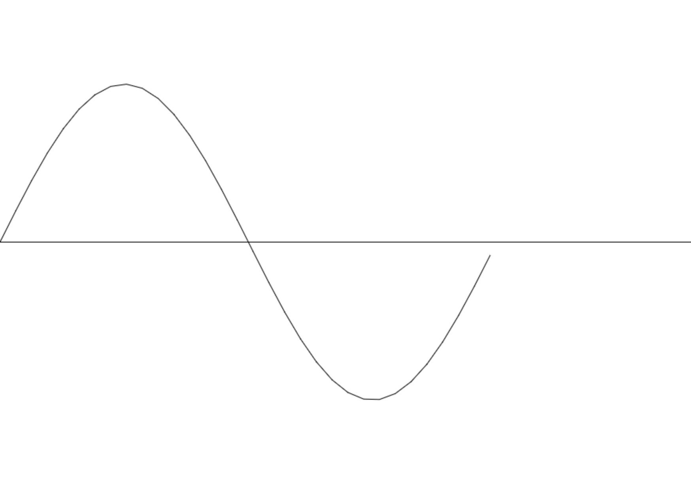 
*Figure 4-10. A right side up sine wave.*

Note that you don't have to to the scaling trick. There are other ways of achieving the same thing. For example, you could change the line that sets the value of `y` to:

    let y = -Math.sin(i) * 100;

Or instead just use `-y` in the next line:

    context.lineTo(x, -y);

In general, the only time I would scale by -1 is if I were creating some kind of math application that had to plot things in Cartesian coordinates. Otherwise, I'd just use values that create the effects I need to create.

Let's take a quick look at the cosine function. We can re-use most of the same code and just switch `Math.cos` for `Math.sin`. You can see this in listing 4-3.

    const canvas = document.getElementById("canvas");
    const context = canvas.getContext("2d");
    const width = canvas.width = window.innerWidth;
    const height = canvas.height = window.innerHeight;

    context.translate(0, height / 2);
    context.Scale(1, -1);

    context.beginPath();
    for (let i = 0; i <= Math.PI * 2; i += 0.2) {
      let x = i * 100;
      let y = Math.cos(i) * 100;
      context.lineTo(x, y);
    }
    context.stroke();

*Listing 4-3*

When you run this, you get the curve you see in figure 4-11.

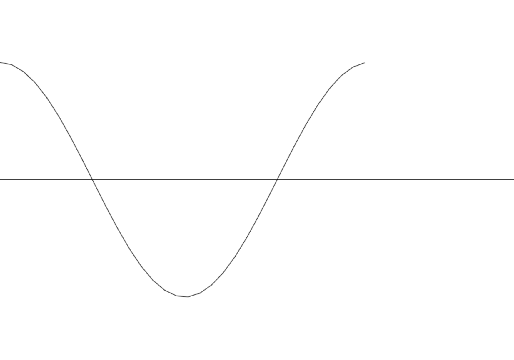 
*Figure 4-11. A cosine wave.*

And figure 4-12 shows a sine and cosie wave plotted together.

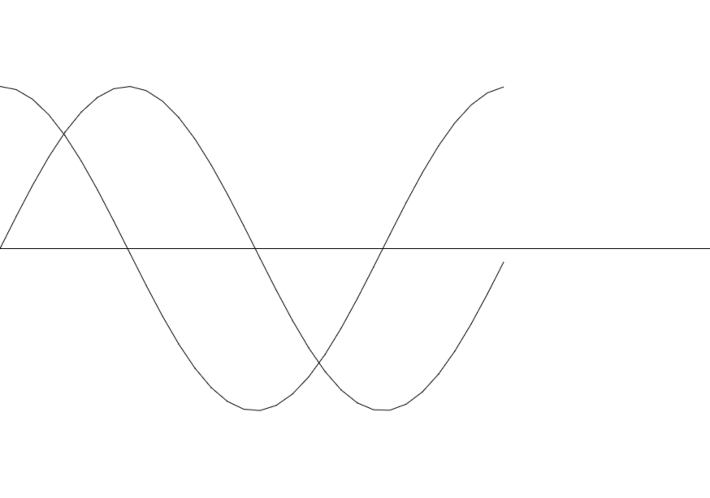 
*Figure 4-12. Sine and cosine.*

You can see that they are really the same curve, with the cosine wave shifteda little bit to the left. The value of cosine at zero degrees is the same as the sine of 90 degrees - one. And the cosine of 90 degrees is the same as the sine of 180 degrees - zero. And so on. So we say that these two curves are 90 degrees out of phase. In the next chapter we'll see how we can use both of these functions together to perform some very useful tasks. In the meantime, let's jump back to sine and learn a little more about that. Everything else about sine in this chapter can apply equally well to cosine.

Going back to listing 4-2, try changing the value that multiply by to get `y` to something smaller, say 20:

    let y = Math.sin(i) * 20;

This gives you the same type of curve, but it looks kind of squashed. See figure 4-13.

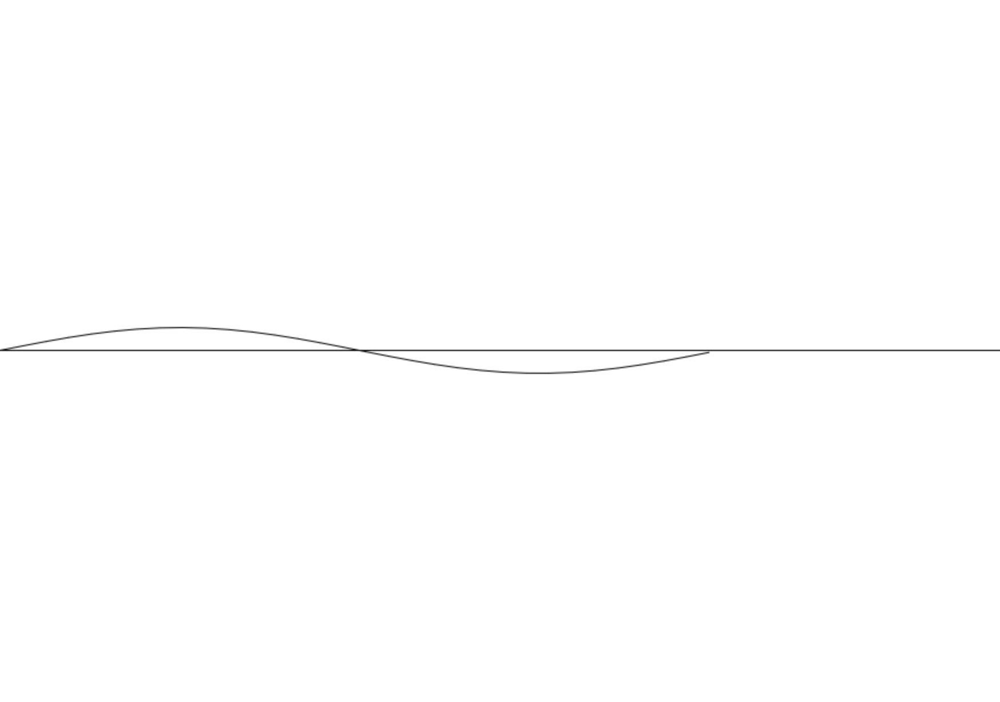 
*Figure 4-13. Changing the wave height.*

So this value changes the height of the wave - how far it goes above and below the y-axis. Now lets shrink the multiplier for the `x` value and also change the value we're using in the `for` loop. The whole program is in listing 4-4.

    const canvas = document.getElementById("canvas");
    const context = canvas.getContext("2d");
    const width = canvas.width = window.innerWidth;
    const height = canvas.height = window.innerHeight;

    context.translate(0, height / 2);
    context.Scale(1, -1);

    context.beginPath();
    for (let i = 0; i <= Math.PI * 10; i += 0.2) {
      let x = i * 20;
      let y = Math.sin(i) * 20;
      context.lineTo(x, y);
    }
    context.stroke();

Now we are going from 0 to `Math.PI *10` radians, which is the equivalent of 360 * 5 degrees. This gives us five cycles of the sine wave. Because 360 degrees is the same as zero, when we go past 360, it's like we're beginning another cycle. So you can just keep increasing that angle and the sine wave will continue going up and down, at least until that angle number gets too big and the program can no longer store it.

Also by changing the multiplier we use to get `x`, we get more cycles in a smaller horizontal space. So we have increased the frequency. And since each wave is shorter, we can also say that we have reduced the wavelength.

Try playing around with all these values and see how each change affects the shape of the curve that's created.
