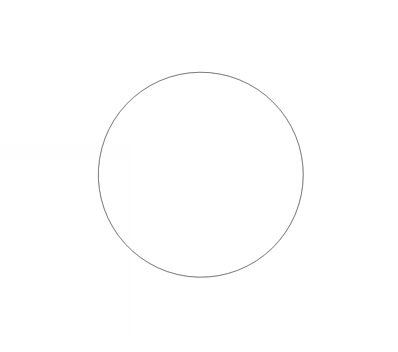
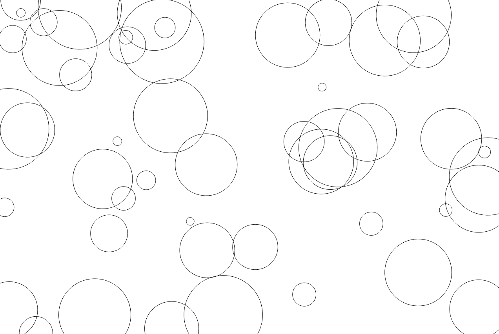

# Chapter 5 - Using Sine and Cosine

In the last chapter we explored the basics of the sine and cosine functions - what they mean, where they come from and how to use them in code.

Now we'll discover some real world practical uses for them.

## Oscillating with sine

Our first examples with using sine in the previous chapter were restricted to graphing the input and output on a 2d plane. But why not jump straight into something exciting like animation? We can update the position, size, orientation, or even the color of an object on each frame of an animation using a sine-based value. This can make the object bounce smoothly up and down, side do side, pulsate, etc. How to achieve animation differs by languages and platform. For the text of this book, we'll continue to use an HTML canvas. We can just clear the canvas and redraw the object in the new position on each frame. But there should be some other examples using other languages in the book's accompanying code repositories. Take a look at the code in listing 5-1 and then we'll go through it step by step.

    const canvas = document.getElementById("canvas");
    const context = canvas.getContext("2d");
    const width = canvas.width = window.innerWidth;
    const height = canvas.height = window.innerHeight;

    let angle = 0;
    let speed = 0.05;

    render();

    function render() {
      context.clearRect(0, 0, width, height);

      let x = width / 2;
      let y = height / 2 + Math.sin(angle) * height * 0.4;

      angle += speed;

      context.beginPath();
      context.arc(x, y, 20, 0, Math.PI * 2);
      context.fill();

      requestAnimationFrame(render);
    }

*Listing 5-1*

We start with the usual canvas/context boilerplate. We set an `angle` and a `speed` variable. On each frame we can add the speed to the angle to increase it gradually.

We then call the `render` function which clears the canvas and then calculates the x, y position of the object we are animating. `x` is just the horizontal center of the canvas. But `y` is the vertical center offset by an amount calculated by the sine of `angle` times a certain amount. I've set that multiplier to `height * 0.4`. This causes the object to move up and down a little bit less than half the canvas's height so it is just short of the top and bottom. We add `speed` to `angle` and then draw a circle with a radius of 20 at that x, y point we just calculated.

I don't want to get too deep into the canvas drawing api here, but the way we draw circles is with the `arc` function. The first three parameters there are the x, y position and the radius. The next two are the start and end angle of the arc you want to draw - in radians. Here, we go from 0 radians to 2π radians, which is a full circle. Just another example of why it's good to be able to think in radians when coding.

The last line causes render to be called again a short time later, so this function gets run over and over, generally up to 60 times per second. Each time the circle is drawn at a slightly different position, then cleared and drawn again, creating an animation.

It won't do much good to show you a static screenshot of an animation, but you can see it in action easily enough by running the code for this example. Or better yet, coding it yourself and messing around with some of the values to see how different numbers change the animation. Try making it go back and forth from left to right instead of up and down too.

But we can do things other than moving the object around. In listing 5-2, I've only changed a few lines. Take a look and see if you can guess what it will do.

    const canvas = document.getElementById("canvas");
    const context = canvas.getContext("2d");
    const width = canvas.width = window.innerWidth;
    const height = canvas.height = window.innerHeight;

    let angle = 0;
    let speed = 0.05;

    render();

    function render() {
      context.clearRect(0, 0, width, height);

      let x = width / 2;
      let y = height / 2;
      let radius = 100 + Math.sin(angle) * 100;

      angle += speed;

      context.beginPath();
      context.arc(x, y, radius, 0, Math.PI * 2);
      context.fill();
      requestAnimationFrame(render);
    }

*Listing 5-2*

Here, the x, y position will always be the direct center of the canvas. So the position is not animating in this case. I've introduced a new variable, `radius`. This is set to 100, plus the sine of `angle`, times 100. That may seem confusing, but do the math. The sine of `angle` will range from -1 to +1. Multiplied by 100 makes that -100 to +100. And added to the initial 100 makes the radius oscillate from 0 to 200. Then, when calling the `arc` function, we just pass in `radius` instead of a hard-coded value. Run that and you should see a circle that pulses in and out of existence. Again, experiment with different values here and see what happens. A good one to try is that value that we multiply the sine by. Instead of 100, try something like 20, so that it reads `let radius = 100 + Math.sin(angle) * 20;` Now the circle is still pulsing, but not quite as much. Its radius is going from 80 to 120 now, which to me makes it look a bit like something is breathing.

In listing 5-3, we have another type of oscillation.

    const canvas = document.getElementById("canvas");
    const context = canvas.getContext("2d");
    const width = canvas.width = window.innerWidth;
    const height = canvas.height = window.innerHeight;

    let angle = 0;
    let speed = 0.05;

    render();

    function render() {
      context.clearRect(0, 0, width, height);

      let x = width / 2;
      let y = height / 2;

      context.globalAlpha = 0.5 + Math.sin(angle) * 0.5;

      angle += speed;

      context.beginPath();
      context.arc(x, y, 200, 0, Math.PI * 2);
      context.fill();
      requestAnimationFrame(render);
    }

*Listing 5-3*

In HTML's canvas, the `globalAlpha` property sets the opacity of anything drawn on the canvas thereafter. A value of 0.0 would be fully transparent, while 1.0 would be fully opaque. We're setting it to 0.5 + the sine of `angle`, time 0.5, which makes it oscillate between 0.0 and 1.0, causing the circle to fade in and out of existence.

You might see a useful pattern emerging here when creating oscillating properties with sine. You choose a base value that you want the final value to oscillate around, and a range of how much you want the final value to vary from that base. The final value is the center, plus the sine times that variance. Stated as a formula:

    final = base + sin(angle) * rangle

And the speed of the oscillation is dependent on how much you increment the angle on each frame.

Listing 5-4 shows yet another example, this time by rotating an object.

    const canvas = document.getElementById("canvas");
    const context = canvas.getContext("2d");
    const width = canvas.width = window.innerWidth;
    const height = canvas.height = window.innerHeight;

    let angle = 0;
    let speed = 0.05;

    render();

    function render() {
      context.clearRect(0, 0, width, height);

      let x = width / 2;
      let y = height / 2;

      let rotation = 0 + Math.sin(angle) * Math.PI / 2;

      angle += speed;

      context.save();
      context.beginPath();
      context.translate(x, y);
      context.rotate(rotation);
      context.rect(-100, -100, 200, 200);
      context.fill();
      context.restore();

      requestAnimationFrame(render);
    }

*Listing 5-4*

Here, the key line is:

      let rotation = 0 + Math.sin(angle) * Math.PI / 2;

Here we are determining an angle to rotate the object by. Going back to the pattern I just mentioned, the base would be 0 and we want it to vary by π/2 in either direction. Remember that π/2 radians equals 90 degrees. So the object will rotate back and forth from -90 to +90. Of course, in this case you really don't need the 0 in that line. I left it in so you can see how it still follows the pattern. But normally I would just write it as:

      let rotation = Math.sin(angle) * Math.PI / 2;

After determining the rotation angle, I do a bit of tricky code to perform the rotation itself. First, I save the current state of the canvas's drawing context. This is so I can revert to that saved state when I'm done drawing the current frame.

I then translate to the x, y position that I want to be the center of the rotation. In this case, it's the center of the canvas. This time I'm drawing a 200x200 square instead of a circle, because it's hard to see a circle rotate. I specify the x, y position of the square as -100, -100, which is half of its width and height. This puts the center of the square at the center of the canvas.

Finally, I restore the context's state, which undoes the translation and rotation so it's in a fresh state for the next frame.

The final oscillation example gets a bit more complex. The code is in listing 5-5.

    const canvas = document.getElementById("canvas");
    const context = canvas.getContext("2d");
    const width = canvas.width = window.innerWidth;
    const height = canvas.height = window.innerHeight;

    let angleX = 0;
    let angleY = 0;
    let speedX = Math.random() * 0.1;
    let speedY = Math.random() * 0.1;

    render();

    function render() {
      context.clearRect(0, 0, width, height);

      let x = width / 2 + Math.sin(angleX) * width * 0.4;
      let y = height / 2 + Math.sin(angleY) * height * 0.4;

      angleX += speedX;
      angleY += speedY;

      context.beginPath();
      context.arc(x, y, 20, 0, Math.PI * 2);
      context.fill();

      requestAnimationFrame(render);
    }

*Listing 5-5*

Here, we return to something pretty close to what we saw in listing 5-1. But instead of just a single `angle` and `speed` variable, we have one each for both the x- and y-axes. And each speed value is set to be a random number from 0.0 to 0.1. Then we calculate `x` as the horizontal center, plus the sine of `angleX`, times `width * 0.4`. You should recognize that pattern by now. And the same pattern goes for `y` using `angleY` and `height`. Then we add the corresponding speed values to each angle value. The result is that the object simultaneously loops back and forth AND up and down, both at random speeds. Each time you refresh the page, you get a new, wild looping motion. Depending on the random values that get used, the animation may follow a very predictable path, or might at first seem totally chaotic.

This kind of two-axis, independent looping forms what is called a Lissajous curve. It's beyond the scope of this book, but can be both beautiful and very useful. If, instead of animating an object through one of these curves, you used the same code to trace out the path of that curve, you would get a shape something like you see in figure 5-1.

*Figure 5-1. Lissajous curve.*

And the code for this example is in listing 5-6.

    const canvas = document.getElementById("canvas");
    const context = canvas.getContext("2d");
    const width = canvas.width = window.innerWidth;
    const height = canvas.height = window.innerHeight;

    let angleX = 0;
    let angleY = 0;
    let speedX = Math.random() * 0.1;
    let speedY = Math.random() * 0.1;

    render();

    function render() {
      context.beginPath();

      for (let i = 0; i < 10000; i++) {
        let x = width / 2 + Math.sin(angleX) * width * 0.4;
        let y = height / 2 + Math.sin(angleY) * height * 0.4;

        angleX += speedX;
        angleY += speedY;

        context.lineTo(x, y);
      }

      context.stroke();
    }

*Listing 5-6*

## Circles and Ellipses

In figure 5-2, I've arranged several right triangles with a common point on the origin. As the angle of each triangle changes and the hypotenuse remains constant, you can see that the far end of the hypotenuse traces out a circle.

*Figure 5-2. Angle around a circle.*

This makes sense when you consider that one definition of a circle is the set of points that are all at an equal distance from a center point. The hypotenuse becomes the radius of the circle, and at any given angle, it defines a point on the circle.

Understanding this, we can use trigonometry to draw circles. While the definition calls for _all_ points at a certain distance from the center, that would be infinite. We can trim that down to a manageable amount. We just need to start at zero and increment the angle bit by bit, drawing a line segment to the point at the end of the hypotenuse on each step. Continue that up to 360 degrees (or 2π radians) and we've drawn a circle.

So how do we figure out where that point is? Using sine and cosine. But kind of backwards to the way we've been doing it so far. We want to know the x, y value of that point, and we'll assume that the center of the circle is at 0, 0, for now. Let's focus on the x value first. We know that the formula for cosine is:

    cos A = adjacent / hypotenuse

Before, we were using this to figure out the cosine of a particular angle. But we know the angle and we can use our handy math library to figure out what the cosine of that angle is. We also know the hypotenuse. It's the radius of the circle we want to draw. The length of the adjacent side in this case will be the x position of the point we are trying to define. Take a look at figure 5-2 again and really make sure you understand this.

We can rearrange the formula to isolate the piece of information we don't know on one side of the equation. We do that by multiplying both sides by the hypotenuse:

    cos A * hypotenuse = adjacent

Put into circle terms and moving the term we want to the left side, we could say:

    x = cos A * radius

For the y value, we use the sine formula:

    sin A = opposite / hypotenuse

Here, the length of the opposite side is the y value we are looking for. Isolating that, we get:

    sin A * hypotenuse = opposite

And translating it into circular terms:

    y = sin A * radius

We can now use all of this to start drawing a circle. See listing 5-7.

    const canvas = document.getElementById("canvas");
    const context = canvas.getContext("2d");
    const width = canvas.width = window.innerWidth;
    const height = canvas.height = window.innerHeight;

    context.translate(width / 2, height / 2);

    let radius = 200;
    context.beginPath();
    for (let i = 0; i < Math.PI * 2; i += 0.1) {
      let x = Math.cos(i) * radius;
      let y = Math.sin(i) * radius;
      context.lineTo(x, y);
    }
    context.closePath();
    context.stroke();

*Listing 5-7*

Here, I translated the context so that we're drawing from the center of the canvas, then I defined the radius. Begin a path, loop through from 0 to 2π, calculating x and y as we just discussed, and drawing a line to that point. This will end just short of 2π, so calling `closePath` will complete the circle, and then we stroke it. The result is in figure 5-3.

*Figure 5-3. Our first circle.*

Let's make this code a little more reusable by creating a circle function. I'll just give you the code for listing 5-8, and then we'll discuss it.

    const canvas = document.getElementById("canvas");
    const context = canvas.getContext("2d");
    const width = canvas.width = window.innerWidth;
    const height = canvas.height = window.innerHeight;

    function circle(context, x, y, radius) {
      context.beginPath();
      for (let i = 0; i < Math.PI * 2; i += 0.1) {
        context.lineTo(x + Math.cos(i) * radius, y + Math.sin(i) * radius);
      }
      context.closePath();
      context.stroke();
    }

    for (let i = 0; i < 50; i++) {
      circle(context,
             Math.random() * width,
             Math.random() * height,
             10 + Math.random() * 100);
    }

*Listing 5-8*

Here I've defined a `circle` function. This takes the context you want to draw on, the x, y center of the circle, and its radius. It does pretty much what we did before, but this time it calculates the x, y point in line, adding the center x, y that was passed into the function. This allows us easily to draw a circle anywhere on the canvas. This is demonstrated in the code that follows, by drawing 50 randomly placed and sized circles. The result of this is shown in figure 5-4.

*Figure 5-4. Fifty random circles.*

You might be wondering about that arbitrary, hard-coded 0.1 value in the for loop that increments the angle. That's just a number I chose. If you were to choose a higher number, say 0.5, you'd get what you see in figure 5-5.

*Figure 5-5. A chunky circle.*

Because 2π divided by 0.5 is about 12.56, we wind up with 13 line segments, one of them about half the length of the others. Using 0.1 to increment gives us almost 63 segments, which renders fairly smoothly at the size circles we've drawn so far. If you start drawing larger circles, you may have to increase the resolution by making that increment value even smaller. Making it too small to begin with means you'll be drawing more line segments than a viewer would ever be able to see. Your program could start to slow down while adding no perceivable increase in rendering quality.

