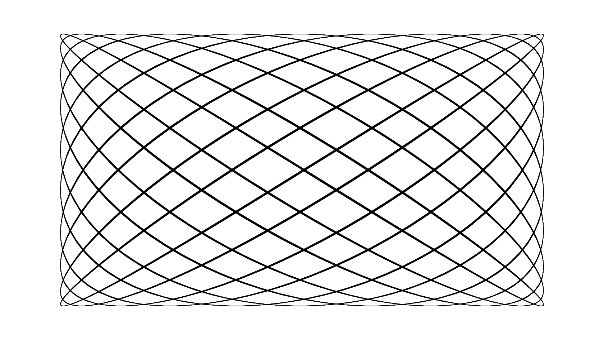

# Chapter 5 - Using Sine and Cosine

In the last chapter we explored the basics of the sine and cosine functions - what they mean, where they come from and how to use them in code.

Now we'll discover some real world practical uses for them.

## Oscillating with sine

Our first examples with using sine in the previous chapter were restricted to graphing the input and output on a 2d plane. But why not jump straight into something exciting like animation? We can update the position, size, orientation, or even the color of an object on each frame of an animation using a sine-based value. This can make the object bounce smoothly up and down, side do side, pulsate, etc. How to achieve animation differs by languaged and platform. For the text of this book, we'll continue to use an HTML canvas. We can just clear the canvas and redraw the object in the new position on each frame. But there should be some other examples using other languages in the book's accompanying code repositories. Take a look at the code in listing 5-1 and then we'll go through it step by step.

    const canvas = document.getElementById("canvas");
    const context = canvas.getContext("2d");
    const width = canvas.width = window.innerWidth;
    const height = canvas.height = window.innerHeight;

    let angle = 0;
    let speed = 0.05;

    render();

    function render() {
      context.clearRect(0, 0, width, height);

      let x = width / 2;
      let y = height / 2 + Math.sin(angle) * height * 0.4;

      angle += speed;

      context.beginPath();
      context.arc(x, y, 20, 0, Math.PI * 2);
      context.fill();

      requestAnimationFrame(render);
    }

*Listing 5-1*

We start with the usual canvas/context boilerplate. We set an `angle` and a `speed` variable. On each frame we can add the speed to the angle to increase it gradually.

We then call the `render` function which clears the canvas and then calculates the x, y position of the object we are animating. `x` is just the horizontal center of the canvas. But `y` is the vertical center offset by an amount calculated by the sine of `angle` times a certain amount. I've set that multiplier to `height * 0.4`. This causes the object to move up and down a little bit less than half the canvas's height so it is just short of the top and bottom. We add `speed` to `angle` and then draw a circle with a radius of 20 at that x, y point we just calculated.

I don't want to get too deep into the canvas drawing api here, but the way we draw circles is with the `arc` function. The first three parameters there are the x, y position and the radius. The next two are the start and end angle of the arc you want to draw - in radians. Here, we go from 0 radians to 2π radians, which is a full circle. Just another example of why it's good to be able to think in radians when coding.

The last line causes render to be called again a short time later, so this function gets run over and over, generally up to 60 times per second. Each time the circle is drawn at a slightly different position, then cleared and drawn again, creating an animation.

It won't do much good to show you a static screenshot of an animation, but you can see it in action easily enough by running the code for this example. Or better yet, coding it yourself and messing around with some of the values to see how different numbers change the animation. Try making it go back and forth from left to right instead of up and down too.

But we can do things other than moving the object around. In listing 5-2, I've only changed a few lines. Take a look and see if you can guess what it will do.

    const canvas = document.getElementById("canvas");
    const context = canvas.getContext("2d");
    const width = canvas.width = window.innerWidth;
    const height = canvas.height = window.innerHeight;

    let angle = 0;
    let speed = 0.05;

    render();

    function render() {
      context.clearRect(0, 0, width, height);

      let x = width / 2;
      let y = height / 2;
      let radius = 100 + Math.sin(angle) * 100;

      angle += speed;

      context.beginPath();
      context.arc(x, y, radius, 0, Math.PI * 2);
      context.fill();
      requestAnimationFrame(render);
    }

*Listing 5-2*

Here, the x, y position will always be the direct center of the canvas. So the position is not animating in this case. I've introduced a new variable, `radius`. This is set to 100, plus the sine of `angle`, times 100. That may seem confusing, but do the math. The sine of `angle` will range from -1 to +1. Multiplied by 100 makes that -100 to +100. And added to the initial 100 makes the radius oscillate from 0 to 200. Then, when calling the `arc` function, we just pass in `radius` instead of a hard-coded value. Run that and you should see a circle that pulses in and out of existance. Again, experiment with different values here and see what happens. A good one to try is that value that we multiply the sine by. Instead of 100, try something like 20, so that it reads `let radius = 100 + Math.sin(angle) * 20;` Now the circle is still pulsing, but not quite as much. Its radius is going from 80 to 120 now, which to me makes it look a bit like something is breathing.

In listing 5-3, we have another type of oscillation.

    const canvas = document.getElementById("canvas");
    const context = canvas.getContext("2d");
    const width = canvas.width = window.innerWidth;
    const height = canvas.height = window.innerHeight;

    let angle = 0;
    let speed = 0.05;

    render();

    function render() {
      context.clearRect(0, 0, width, height);

      let x = width / 2;
      let y = height / 2;

      context.globalAlpha = 0.5 + Math.sin(angle) * 0.5;

      angle += speed;

      context.beginPath();
      context.arc(x, y, 200, 0, Math.PI * 2);
      context.fill();
      requestAnimationFrame(render);
    }

*Listing 5-3*

In HTML's canvas, the `globalAlpha` property sets the opacity of anything drawn on the canvas thereafter. A value of 0.0 would be fully transparent, while 1.0 would be fully opaque. We're setting it to 0.5 + the sine of `angle`, time 0.5, which makes it oscillate between 0.0 and 1.0, causing the circle to fade in and out of existence.

You might see a useful pattern emerging here when creating oscillating properties with sine. You choose the center point that you want the value to go back and forth around, and how much you want the value to vary from that center. The final value is the center, plus the sine times that variance.

Listing 5-4 shows yet another example, this time by rotating an object.

    const canvas = document.getElementById("canvas");
    const context = canvas.getContext("2d");
    const width = canvas.width = window.innerWidth;
    const height = canvas.height = window.innerHeight;

    let angle = 0;
    let speed = 0.05;

    render();

    function render() {
      context.clearRect(0, 0, width, height);

      let x = width / 2;
      let y = height / 2;

      let rotation = 0 + Math.sin(angle) * Math.PI / 2;

      angle += speed;

      context.save();
      context.beginPath();
      context.translate(x, y);
      context.rotate(rotation);
      context.rect(-100, -100, 200, 200);
      context.fill();
      context.restore();

      requestAnimationFrame(render);
    }

*Listing 5-4*

Here, the key line is:

      let rotation = 0 + Math.sin(angle) * Math.PI / 2;

Here we are determining an angle to rotate the object by. Going back to the pattern I just mentioned, the center would be 0 and we want it to vary by π/2 in either direction. Remember that π/2 radians equals 90 degrees. So the object will rotate back and forth from -90 to +90. Of course, in this case you really don't need the 0 in that line. I just left it in so you can see how it still follows the pattern.

After determining the rotation angle, I do a bit of tricky code to perform the rotation itself. First, I save the current state of the canvas's drawing context. I then translate to the x, y position I want the object appear at and then perform the rotation. This ensures that the rotation is done around that x, y point, so the object is rotating around the center of the canvas in this case. And here, I'm drawing a 200x200 square instead of a circle, but cause it would be pretty tough to determine whether or not a solid colored circle was rotating. Finally, I restore the context's state, which undoes the translation and rotation so it's all set for the next frame.

The final oscillation example gets a bit more complex. The code is in listing 5-5.

    const canvas = document.getElementById("canvas");
    const context = canvas.getContext("2d");
    const width = canvas.width = window.innerWidth;
    const height = canvas.height = window.innerHeight;

    let angleX = 0;
    let angleY = 0;
    let speedX = Math.random() * 0.1;
    let speedY = Math.random() * 0.1;

    render();

    function render() {
      context.clearRect(0, 0, width, height);

      let x = width / 2 + Math.sin(angleX) * width * 0.4;
      let y = height / 2 + Math.sin(angleY) * height * 0.4;

      angleX += speedX;
      angleY += speedY;

      context.beginPath();
      context.arc(x, y, 20, 0, Math.PI * 2);
      context.fill();

      requestAnimationFrame(render);
    }

*Listing 5-5*

Here, we return to something pretty close to what we saw in listing 5-1. But instead of just a single `angle` and `speed` variable, we have one each for both the x- and y-axes. And each speed value is set to be a random number from 0.0 to 0.1. Then we calculate `x` as the horizontal center, plus the sine of `angleX`, times `width * 0.4`. And use a similar pattern for `y` using `angleY` and `height`. Then we add the corresponding speed values to each angle value. The result is that the object simultaneously loops back and forth AND up and down, both at random speeds. Each time you refresh, you get a new, wild looping, which at first seems unpredictable, but if you watch it for a few seconds, has a definite pattern.

This kind of two-axis, independant looping forms what is called a Lissajous curve. It's beyond the scope of this book, but can be both beautiful and very useful.

*Figure 5-1. Something.*

