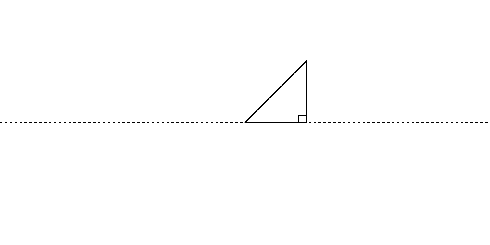
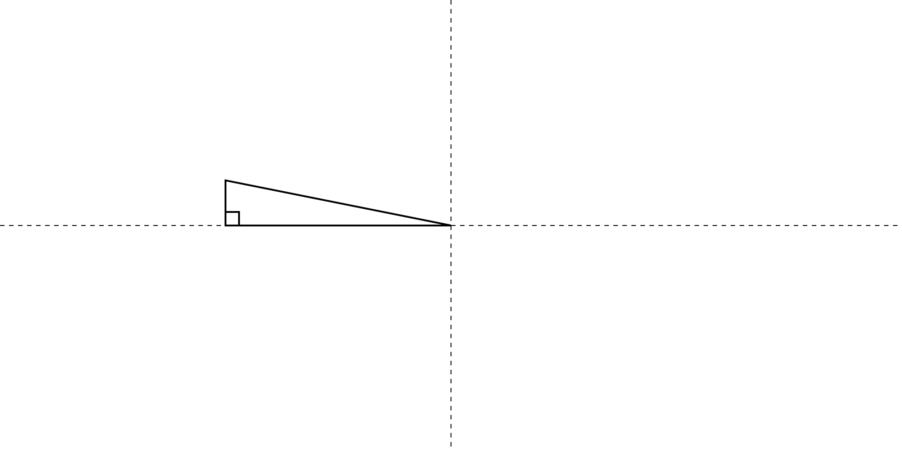
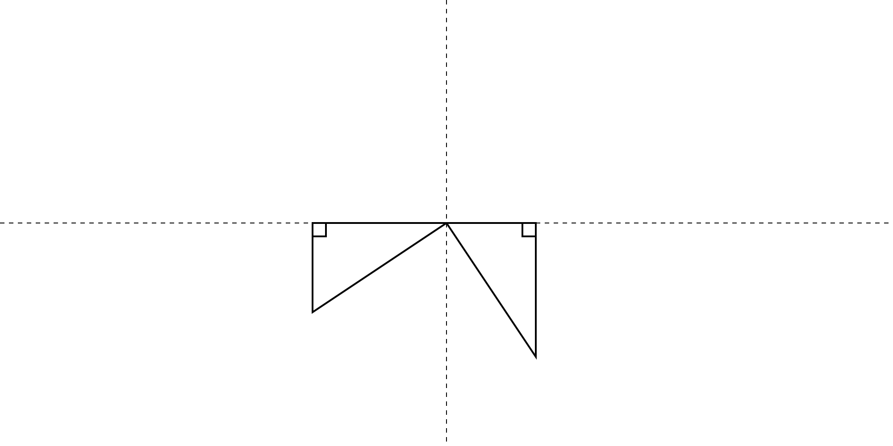
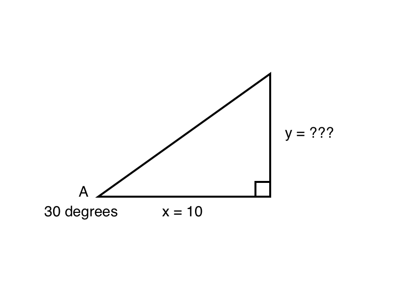

# Chapter 6 - Tangent and Arc Tangent

In the previous two chapters, we've discussed two of the three core trigonometric functions - sine and cosine. We've seen some useful techniques that implement these functions and how closely these two functions relate to each other. But what about the third function, tangent? Is it that different? Does it have no practical uses? Well, yes, it's quite different from both sine and cosine in how it works. But there are some extremely useful techniques that you can employ with tangent. We'll discover some of them in this chapter.

We'll also look into the arc tangent function, which is the inverse of tangent. Don't worry about what that means exactly just yet. We'll get there shortly.

## The basics of tangent 

As we covered earlier, tangent is just a name for the ratio of the side opposite an angle, to the side adjacent to that angle (in a right triangle). You know well by now that sine and cosine are the ratio of the adjacent and opposite sides to the hypotenuse, which is why they wind up being so similar - they both have that hypotenuse in common. But tangent ignores that side altogether. This results in it being far more different than you might imagine. Let's walk through the tangents of an angle as that angle goes through 360 degrees, like we did for sine and cosine.

We start with an angle close to zero, as seen in figure 6-1.

*Figure 6-1. An angle close to zero.*

If tangent is the opposite over adjacent, you can imagine that if the angle went all the way down to zero, then the length of the opposite side would be zero. So no matter what the length of the adjacent side was, the tangent of zero will be zero.

As the angle increases, the opposite side gets longer and the adjacent side gets shorter. When we hit 45 degrees, the opposite and adjacent sides happen to be the same length, so the tangent of 45 degrees is one. See figure 6-2.

*Figure 6-2. A 45-degree angle.*

At this point, you might think that we're heading into another sine-like curve. But hold that thought. As that angle continues to increase, the opposite side continues to get longer and the adjacent continues to shrink. As you can see in figure 6-3, the ratio of these two starts to become much higher than one.

*Figure 6-3. An angle close to 90 degrees.*

In fact, as the angle gets very close to 90 degrees, the length of the adjacent side becomes infinitesimal. This means that the tangent approaches infinity. And when the angle reaches exactly 90 degrees, the length of the adjacent side becomes exactly zero. Now, no matter what the length of the opposite side is, we wind up in a divide-by-zero situation, which is undefined. And so it is that you can't calculate the tangent of 90 degrees (or π/2 radians). Try it in a physical calculator and it should give you an error.

If you use a web based calculator app, however, you might get some large number like `1.6331239e+16` (that's scientific notation, equal to `1.6331239 * 10^16`. 

That's because web based calculators are done in JavaScript. Try this in JavaScript:

    Math.tan(Math.PI / 2);

In Chrome, this gives me `16331239353195370`. You might get different results in different languages and platforms. Some might give you an error. Some might give you a large number like this. My best guess is that because π/2 is an irrational number, it cannot be accurately held in a JavaScript variable. So you are getting the tangent of a value close to, but not exactly π/2. The adjacent side will be very tiny, but not exactly zero, so you get a large number for an answer, not undefined.

Continuing past 90 degrees, the adjacent side becomes negative. When it's just barely over 90 degrees, the tangent will be approaching negative infinity. At 135 degrees, the opposite and adjacent sides will be the same length, but because the adjacent side is in the negative realm, the tangent of 135 degrees is -1.

Continuing on towards 180 degrees, the opposite side goes towards zero, as does the tangent of the angle. See figure 6-4.

*Figure 6-4. Approaching 180 degrees.*

Beyond 180 degrees, both sides are negative, so the ratio goes positive again, to approach infinity again, and then undefined at 270 degrees. In the final quadrant, the adjacent side is positive and the opposite is negative, so we start again at near negative infinity and go back up to zero at 360 degrees. See figure 6-5.

*Figure 6-5. Angles in the third and fourth quadrants.*

Let's plot it out and see what kind of curve this creates. See listing 6-1:

    const canvas = document.getElementById("canvas");
    const context = canvas.getContext("2d");
    const width = canvas.width = window.innerWidth;
    const height = canvas.height = window.innerHeight;

    context.translate(0, height / 2);
    context.scale(1, -1); // to flip the sine wave to Cartesian coords.

    context.beginPath();
    for (let i = 0; i <= Math.PI * 10; i += 0.01) {
      let x = i * 100;
      let y = Math.tan(i) * 20;
      context.lineTo(x, y);
    }
    context.stroke();

    context.lineWidth = 0.25;
    context.beginPath();
    context.moveTo(0, 0);
    context.lineTo(width, 0);
    context.stroke();

*Listing 6-1*

This is very similar to listing 4-4 in chapter 4, other than the fact that it uses `Math.tan` rather than `Math.sin` and a few of the values have been changed to show the curve better. Thus, I won't go through the details of the code here. What it gives you is shown in figure 6-6.

*Figure 6-6. Tangent plotted out.*

As described, the curve starts at zero for zero degrees. It shoots up to infinity as it nears 90 degrees (π/2 radians) and then jump back down towards negative infinity just past 90 degrees. Because we are drawing a single continuous series of line segments to create the curve, we see a nearly vertical line connecting the high positive and high negative values. Most times you see tangent plotted out, that vertical line will either be shown as a dotted line or not shown at all. The fact that it's drawn here is just a byproduct of our drawing routine.

## Uses of tangent

I'll be straight with you. For the most part, tangent is uses way, way less than sine or cosine. I could dive into some contrived examples of where you might use tangent, but I'd rather stick to things you'll actually need to use on a regular basis. 

But I will give a very quick conceptual idea. Say you have a right triangle. You know one angle and the length of the adjacent side of that angle. And you want to know the length of the opposite side, as seen in figure 6-7. 

*Figure 6-7. Use of tangent.*
# need this figure

We'll call the opposite side y and the adjacent side x. We know that the angle A is 30 degrees and x is equal to 10. Well, the formula would be:

    tan A = y / x

because the tangent is the opposite over adjacent. Substituting the values we know, we get:

    tan 30 = y / 10

Then we can put the value we don't know on one side:

    y = (tan 30) * 10

We can use a calculator to discover that the tangent of 30 degrees is about 0.577. So we get:

    y = 0.577 * 10

So the length of the opposite side is roughly 5.77.

Now, if you run into something like that, which you just might from time to time, you'll know what to do. But for now, I'm going to go into a new concept that will give us some extremely handy uses for tangent - or at least one of its close relatives.

## Arc functions (inverse trigonometric functions)

Thus far, I've introduced the three main trigonometric functions: sine, cosine and tangent. But there are several other functions that fall under the subject of trig. The first of these are known sometimes as "arc functions" or "inverse trigonometric functions. Their names are arc sine, arc cosine and arc tangent.

The inverse part makes a lot of sense because they are the mathematical inverse of the functions they are named after. For example, we know that the sine of an angle is equal to the ratio of its opposite side and the hypotenuse.  But the arc sine function takes the ratio of an opposite side and a hypotenuse and returns the angle relating to those to lengths.

Say you have the situation shown in figure 6-8:

*Figure 6-8. Arc sine.*
# need this figure

We have the length of the hypotenuse (10) and the opposite side (5). The ratio (opposite divided by hypotenuse) is 0.5. And the arc sine of 0.5 is 30 degrees.

Or, to be even more concise:

The sine of 30 degrees is 0.5. 

The arc sine of 0.5 is 30 degrees.

Now you see why they are inverse functions. Sine, cosine and tangent take an angle and give you a ratio. The arc versions take a ratio and give you back the angle.

You might see inverse functions written in a couple of different ways. One is just spelling out the arc: `arc sin`. Or sometimes without the space: `arcsin`. Another way is with a superscripted -1 after the name of the function, `sin``-1`.

Of course, this is the same with `arc cos`, `arccos`, `cos``-1`, `arc tan`, `arctan` and `tan``-1`

## Arc tangent

When we enter the realm of arc functions, the importances reverse. Here, you'll find the occasional use for arc sine and arc cosine, but arc tangent is a real powerhouse.
