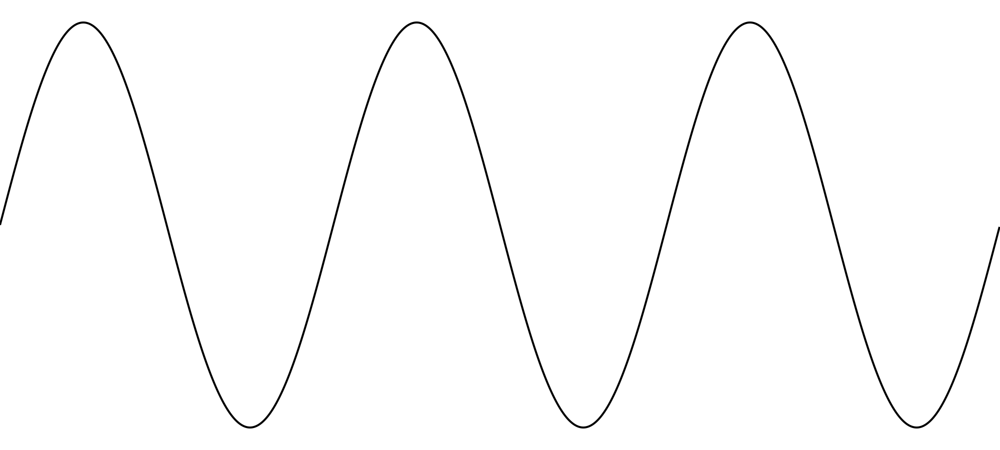
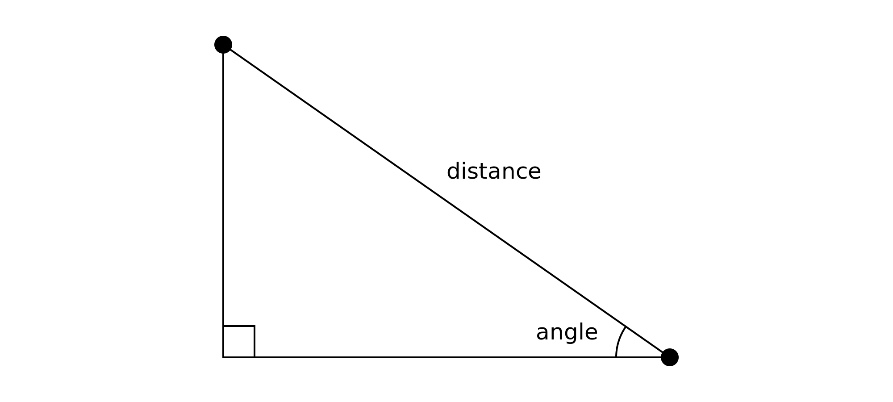

# Chapter 1 - Introduction

Well, here you are, reading a book about trigonometry. There's a good chance you're grimacing somewhat - biting the bullet and hoping this won't be too bad. Trigonometry can be hard. People struggle with it. You might be thinking that this is a subject you need to get a better handle on, and if this book helps you a bit, it might be worth the pain.

I can't promise you that it won't be hard or it won't be painful. That's somewhat out of my control. But I'm going to do my utmost to make it as easy as possible. If I succeed, it really might not be painful at all. You might even enjoy reading this book.

## Do you need to learn trigonometry for programming?

Not necessarily. It all depends what kind of programming you're doing. If you're doing back end database and api coding, you might never need a line of trig. Even if you're doing pure front end application logic and UI code, the times you really need trig may be few and far between.

But if you're doing any kind of graphics programming, simulations, game development, low-level audio programming, or creative coding, you're probably going to use some trigonometry every day of your life. Or at least every day that you write code.

Trigonometry is the study of the relationship of the angles and side lengths of triangles. It may seem strange that is is used so often, even if you're not drawing triangles. But it turns out that trigonometry's end uses far surpass just measuring triangles. Say you want to make something oscillate back and forth or up and down. A sine wave is a great solution. See figure 1-1.

*Figure 1-1. A sine wave.*

Want to move something around in a circle or oval? Or arrange objects around in a circle or oval? Trig is vital there. Want to make an object point at or move towards the mouse, or some other point? Trigonometry again. Need to know the distance from one point on the screen to another (as seen in figure 1-2)? Trigonometry is involved.

*Figure 1-2. Using trig to find distance between two points.*

Simulating any kind of physics with acceleration and velocity? You'll need trig. In audio programming, sound waves can be generated directly with sine waves, or can be synthesized by multiple sine waves at different frequencies and strengths.

The list is endless. In this book I'll cover most of the above examples, and a lot more. There's a whole lot more that I won't be able to cover, but once you know the basics, you'll be ready to tackle anything trig-related.

## Why JavaScript?

The text of this book will use JavaScript to demonstrate working code for the various concepts thar are being explained. But those concepts transcend any single language. The accompanying source files, however, will include code in JavaScript and at least one or two other languages to start. It's my hope that even more languages will be added over time. Every effort will be made to try to have the sample files in other languages match, as much as possible, the original JavaScript shown in the book's text. Of course, there will be differences; there's no escaping that. But you should be able to follow along with the text of the book and the code in the language of your choice.

JavaScript was chosen as the default language for a number of reasons.

1. It's free and open source.

2. It runs on pretty much any platform in existence today.

3. You don't need any special tools to code, compile and run JavaScript programs.

4. JavaScript is generally pretty easy to learn and a huge percentage of programmers have at least some experience with it.

5. HTML5 comes with a Canvas object that has a very usable graphics api.

## Math Library Comparisons

If you're coding trigonometry, you're going to need a decent math library. Most modern languages come with one of those built in. And they are remarkably standard across many languages.

Listing 1-1 shows a few of the more common functions of the JavaScript math library, compared to the math libraries of some other common languages.

    Sine:
      JavaScript: Math.sin(angle)
      C#:         Math.Sin(angle)
      Go:         math.Sin(angle)
      Python:     math.sin(angle)
      Processing: sin(angle)

    Square Root:
      JavaScript: Math.sqrt(value)
      C#:         Math.Sqrt(value)
      Go:         math.Sqrt(angle)
      Python:     math.sqrt(value)
      Processing: sqrt(value)

    Pi:
      JavaScript: Math.PI
      C#:         Math.PI
      Go:         math.Pi
      Python:     math.pi
      Processing: PI

*Listing 1-1*

This isn't all of the functions by far, but you can see that for the most part, translating the math functions from JavaScript to some other language is, for the most part, trivial. Don't worry if you don't know what some (or any) of those functions are. They'll all be covered in the book.

## Boilerplate

Let's look at the HTML and JavaScript code that will be used throughout the book to create and run examples. The accompanying code for other languages will have different formats, but should have somewhat similar structures.

Each project will contain two base files: `index.html` and `main.js`. The HTML file will create the canvas element, apply some minimal styling, and load the `main.js` file, as seen in listing 1-2.

    <!DOCTYPE html>
    <html>
      <head>
        
      </head>
      <body>
        <canvas id="canvas"></canvas>
        
      </body>
    </html>

*Listing 1-2*

Now the `main.js` file in listing 1-3.

    const canvas = document.getElementById("canvas");
    const context = canvas.getContext("2d");
    const width = canvas.width = window.innerWidth;
    const height = canvas.height = window.innerHeight;

    // sample drawing code:
    for (let i = 0; i < 100; i++) {
      context.lineTo(Math.random() * width, Math.random() * height);
    }
    context.stroke();

*Listing 1-3*

This gets a reference to the canvas element, and gets a reference to the 2d drawing context from the canvas. This context is what you'll use to issue all of your drawing commands.

It sets the canvas size to the size of the browser content area using `window.innerWidth` and `window.innerHeight`, and also saves those values in the `width` and `height` variables for later use.

That itself is all the boilerplate. Below that I included a few lines of sample drawing code. This just executes a `for` loop to draw 100 random lines on the canvas. Figure 1-3 shows the result.

*Figure 1-3. Random lines.*

Note that the boilerplate does not include any page loading event listeners or callbacks, classes, or anything else fancy. Also notice that it does not require, include, or import any other external libraries. In more complex example, there will of course be some more complex code, but for the most part I'm going to keep things as bare-bones and simple as humanly possible. This is all in the interest of making the code as understandable and as portable as humanly possible.

TODO: outline of book

\newpage
